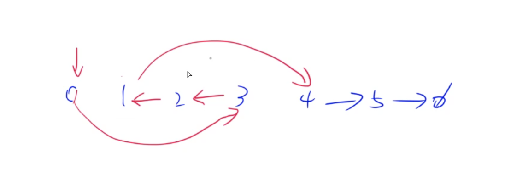

<!--
 * @Description: 
 * @Versions: 
 * @Author: Vernon Cui
 * @Github: https://github.com/vernon97
 * @Date: 2020-11-20 21:48:53
 * @LastEditors: Vernon Cui
 * @LastEditTime: 2020-11-22 18:23:33
 * @FilePath: /Leetcode-notes/week03.md
-->
# Week 03 - Leetcode 21 - 30

#### 21 - 合并两个有序链表
二路归并

```cpp
class Solution {
public:
    ListNode* mergeTwoLists(ListNode* l1, ListNode* l2) {
        // 双指针 
        ListNode* dummy = new ListNode(0), *cur = dummy;

        while(l1 && l2)
        {
            if(l1->val < l2->val)
                cur->next = l1, l1 = l1->next;
            else
                cur->next = l2, l2 = l2->next;
            cur = cur->next;
        }

        ListNode* l = l1 ? l1 : l2;
        while(l)
        {
            cur = cur->next = l;
            l = l->next;
        }
        return dummy->next;
    }
};
```

#### 22 - 括号生成
括号序合法的充分必要条件是左括号数量大于等于右括号的数量 （卡特兰数）

```cpp
class Solution {
public:
    int n;
    vector<string> res;
public:
    void dfs(int l_num, int r_num, string path)
    {
        if(l_num == n && r_num == n)
        {
            res.push_back(path);
            return;
        }
        if(l_num < n)   dfs(l_num + 1, r_num, path + '(');
        if(l_num > r_num) dfs(l_num, r_num + 1, path + ')');
    }
    vector<string> generateParenthesis(int n) {
        this->n = n;
        dfs(0, 0, "");
        return res;
    }
};
```

#### 23 - 合并K个升序链表

K路归并， 用堆找最小值；
>__Note:__ 在C++中, 优先队列传入自定义的比较函数是传入一个自定义的Struct 重载括号

```cpp
class Solution {
public:
    // 容器的比较 传入结构体 重构括号
    struct Cmp{
        bool operator() (ListNode* a, ListNode* b)
        {
            return a->val > b->val;
        }
    };
    ListNode* mergeKLists(vector<ListNode*>& lists) {
        priority_queue<ListNode*, vector<ListNode*>, Cmp> heap;
        ListNode* dummy = new ListNode(-1), *tail = dummy;
        for(auto l : lists) if(l) heap.push(l);

        while(heap.size())
        {
            auto t = heap.top();
            heap.pop();
            tail = tail->next = t;
            if(t->next) heap.push(t->next);
        }   
        return dummy->next;
    }
};
```

#### 24 - 两两交换链表中的节点

这种链表题在纸上画一画指针是怎么倒腾的；

```cpp
class Solution {
public:
    ListNode* swapPairs(ListNode* head) {
        ListNode* dummy = new ListNode(0), *cur = dummy;
        dummy->next = head;
        while(cur->next && cur->next->next)
        {
            ListNode* a = cur->next, *b = a->next;
            a->next = b->next;
            cur->next = b;
            b->next = a;
            cur = a;
        }
        return dummy->next;
    }
};
```

#### 25 - K个一组反转链表



1. 是否剩余k个
2. 内部指向反转
3. 头尾指向调整

```cpp
class Solution {
public:
    ListNode* reverseKGroup(ListNode* head, int k) {
        ListNode* dummy = new ListNode(0), *cur = dummy;
        dummy->next = head;
        while(check(cur, k))
        {

            ListNode* a = cur->next, *b = a->next;
            // 1. 内部指向反转
            for(int i = 0; i < k - 1; i++)
            {  
                ListNode* c = b->next; // 先存下来 避免找不着了
                b->next = a;
                a = b, b = c;
            }
            // 2. 首尾处理
            ListNode* c = cur->next;
            cur->next = a;
            c->next = b;
            cur = c; 
        }
        return dummy->next;
    }
    bool check(ListNode* p, int k)
    {
        for(int i = 0; i <= k; i++, p = p->next)
            if(!p) return false;
        return true;
    }
};
```

#### 26 - 删除排序数组中的重复项

