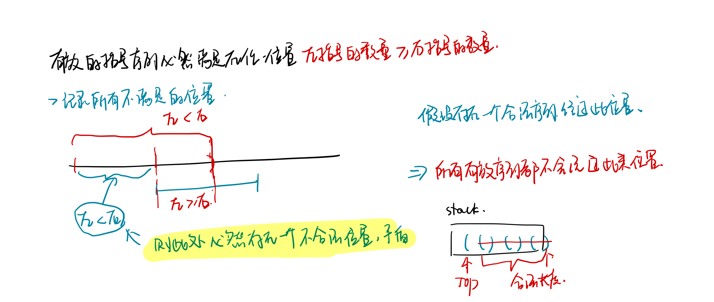

<!--
 * @Description: 
 * @Versions: 
 * @Author: Vernon Cui
 * @Github: https://github.com/vernon97
 * @Date: 2020-11-22 21:28:13
 * @LastEditors: Vernon Cui
 * @LastEditTime: 2020-11-23 22:10:11
 * @FilePath: /Leetcode-notes/week04.md
-->
# Week 04 - Leetcode 31 - 40

#### 31 - 下一个排列

```diff
+ 这题真的是写一次忘一次
```

实际上本题是模拟一个C++中的一个库函数 next_permutation, 用法和sort差不多；
定义在头文件algorithm中，有next_permutation 和 prev_permutation两种；
如果存在a之后的排列，就返回true。如果a是最后一个排列没有后继，返回false，每执行一次，a就变成它的后继;

```cpp
class Solution {
public:
    void nextPermutation(vector<int>& nums) {
        next_permutation(nums.begin(), nums.end());
    }
};
```

当然这么写肯定会被打了（逃

实际上，从后往前，找到第一个非降序的位置，找到第一个比当前元素大的元素并交换。

找下一个排列就是从后往前寻找第一个出现降的地方，把这个地方的数字与后边某个比它大的的数字交换，再把该位置之后整理为升序。

否则从数组末尾往前找，找到 第一个 位置`j`，使得 `nums[j] < nums[j + 1]`。

如果不存在这样的 `j`，则说明数组是不递增的，直接将数组逆转即可。

如果存在这样的 `j`，则从末尾找到第一个位置 `i > j`，使得 `nums[i] > nums[j]`。

交换 `nums[i]` 与 `nums[j]`，然后将数组从 `j + 1` 到末尾部分逆转

```cpp
class Solution {
public:
    void nextPermutation(vector<int>& nums) {
        int k = nums.size() - 1;
        // 1. 找到第一个递减点 e,g, 1,2,3 -> 1,3,2
        while(k > 0 && nums[k - 1] >= nums[k]) k--;
        if(k == 0) reverse(nums.begin(), nums.end()); // 如果降序排列 直接反转
        else
        {
            // 2. 找到 k - 1 右边第一个比nums[k - 1]大的元素
            int i = nums.size() - 1;
            while(i > k && nums[i] <= nums[k - 1]) i--;
            swap(nums[k - 1], nums[i]);
            // 交换完之后仍然是降序（字典序最大) 转换为升序(字典序最小)
            reverse(nums.begin() + k, nums.end());
        }
    }
};
```

其中，找右边第一个比`nums[k - 1]`大的元素可以用什么优化 -> __二分__

__二分优化版__

```cpp
class Solution {
public:
    void nextPermutation(vector<int>& nums) {
        int k = nums.size() - 1;
        // 1. 找到第一个递减点 e,g, 1,2,3 -> 1,3,2
        while(k > 0 && nums[k - 1] >= nums[k]) k--;
        if(k == 0) reverse(nums.begin(), nums.end()); // 如果降序排列 直接反转
        else
        {
            // 2. 找到 k - 1 右边第一个比nums[k - 1]大的元素
            //int i = nums.size() - 1;
            //while(i > k && nums[i] <= nums[k - 1]) i--;
            int l = k, r = nums.size() - 1;
            while(l < r)
            {
                int mid = l + r + 1 >> 1;
                if(nums[mid] > nums[k - 1]) l = mid;
                else r = mid - 1;
            }
            swap(nums[k - 1], nums[r]);
            // 交换完之后仍然是降序（字典序最大) 转换为升序(字典序最小)
            reverse(nums.begin() + k, nums.end());
        }
    }
};
```

#### 32 - 最长有效括号

```diff
- 经典劝退题
```

有这样一个假设
> 标记任何不满足`s[1..i]`中左括号数量>=右括号数量的位置，所有有效括号序列都不会经过这些位置

证明：反证法↓


__所以整个序列被分成了不同的段，每一段都一定满足左括号的数量>=右括号的数量__

在每一段内 用栈来对应左右括号 记录最大长度

如果栈为空，则证明这是一个不合法位置，更新start（即为开始下一段）

```cpp
class Solution {
public:
    int longestValidParentheses(string s) {
        stack<int> stk;

        int res = 0;
        for(int i = 0, start = -1; i < s.size(); i++)
        {
            if(s[i] == '(') stk.push(i);
            else
            {
                if(stk.size())
                {
                    stk.pop();
                    if(stk.size())
                        res = max(res,  i - stk.top());
                    else
                        res = max(res, i - start);
                }
                else
                {
                    start = i;
                }
            }
        }
        return res;
    }
};
```

#### 33 - 搜索旋转排序数组

二分一把梭


```cpp
class Solution {
public:
    int search(vector<int>& nums, int target) {
        if(nums.empty()) return -1;
        // 二分吧
        int l = 0, r = nums.size() - 1;
        while(l < r)
        {
            int mid = l + r + 1 >> 1;
            if (nums[mid] >= nums[0])   l = mid;
            else r = mid - 1;
        }
        if(target >= nums[0]) l = 0; // r = r;
        else l++, r = nums.size() - 1;
        while(l < r)
        {
            int mid = l + r >> 1;
            if(nums[mid] >= target) r = mid;
            else l = mid + 1; 
        }
        return nums[r] == target ? l : -1;
    }
};
```
