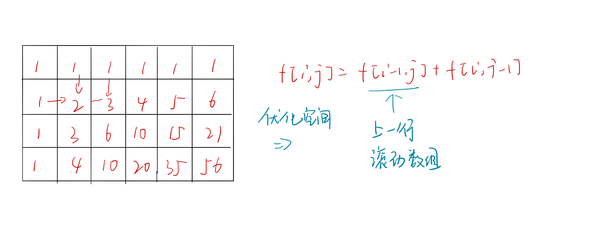

<!--
 * @Description: 
 * @Versions: 
 * @Author: Vernon Cui
 * @Github: https://github.com/vernon97
 * @Date: 2020-11-27 16:49:09
 * @LastEditors: Vernon Cui
 * @LastEditTime: 2020-11-29 00:24:08
 * @FilePath: /Leetcode-notes/week07.md
-->
# Week 07 - Leetcode 61 - 70

#### 61 - 旋转链表


```cpp
class Solution {
public:
    ListNode* rotateRight(ListNode* head, int k) {
        if(!head) return head;
        int n = 1;
        ListNode* tail = head, *cur = head, *res = head;
        while(tail->next)
            tail = tail->next, n++;
        tail->next = head;
        k = n - 1 - (k % n);
        while(k--)
            cur = cur->next;
        res = cur->next;
        cur->next = nullptr;
        return res;
    }
};
```

#### 62 - 不同路径

```diff
+ DP
```



基础的dp，初始化第一行第一列都为1 然后状态转移方程 `f[i][j] = f[i - 1][j] + f[i][j - 1]`

仅用到上一行 可以用滚动数组优化空间；

实际上答案就是一个组合数问题， 从 `(n - 1 + m - 1)` 个操作中选出 `(n - 1)` 个向下；

```cpp
class Solution {
public:
    int uniquePaths(int n, int m) {
        vector<vector<int>> f(2, vector<int>(m, 1));
        int k = 0;
        for(int i = 1; i < n; i++, k = 1 - k)
            for(int j = 1; j < m; j++)
                f[k][j] = f[1 - k][j] + f[k][j - 1];
        return f[1 - k][m - 1];
    }
};
```

#### 63 - 不同路径II

在上一题的基础上增加了一些不能走的点， 不能走就设成0，能走和上题一样；
为了避免边界问题， 可以多加一行和一列，值为0；

```cpp
class Solution {
public:
    int uniquePathsWithObstacles(vector<vector<int>>& obstacleGrid) {
        if(obstacleGrid[0][0]) return 0;
        int n = obstacleGrid.size(), m = obstacleGrid[0].size();
        vector<vector<int>> f(n + 1, vector<int>(m + 1));
        for(int i = 1; i <= n; i++)
            for(int j = 1; j <= m; j++)
                if(i == 1 && j == 1) f[i][j] = 1 - obstacleGrid[i - 1][j - 1];
                else    f[i][j] = (1 - obstacleGrid[i - 1][j - 1]) * (f[i - 1][j] + f[i][j - 1]);
        return f[n][m]; 
    }
};
```

#### 64 - 最小路径和

同样是动态规划，枚举从起点走到每个点的最小权值；

同样也是多加一行避免边界情况；

```cpp
class Solution {
public:
    int minPathSum(vector<vector<int>>& grid) {
        int n = grid.size(), m = grid[0].size();
        // 依旧是动态规划；
        vector<vector<int>> f(n + 1, vector<int>(m + 1, 2e9));
        f[0][1] = f[1][0] = 0;
        for(int i = 1; i <= n; i++)
            for(int j = 1; j <= m; j++)
                f[i][j] = min(f[i - 1][j], f[i][j - 1]) + grid[i - 1][j - 1];
        return f[n][m];
    }
};
```

#### 65 - 有效数字

这题没什么意义.. 面向测试用例编程罢了 不做也行 (😁

#### 66 - 加一

```diff
+ 高精度加法
```

前面做过一个类似的

```cpp
class Solution {
public:
    vector<int> plusOne(vector<int>& digits) {
        // 高精度加法
        if(digits.empty()) return {1};
        int n = digits.size(), f = 1;
        for(int i = n - 1; i >= 0; i--)
        {
            f += digits[i];
            digits[i] = f % 10;
            f /= 10;
            if(!f) break;
        }
        if(f) digits.insert(digits.begin(), f);
        return digits;
    }
};
```

#### 67 - 二进制求和

```diff
+ 高精度加法
```

可以说和上面的题基本一样了

```cpp
class Solution {
public:
    string addBinary(string a, string b) {
        stringstream ss;
        int i = a.size() - 1, j = b.size() - 1, f = 0;
        while(i >= 0 || j >= 0)
        {
            if(i >= 0) f += a[i] - '0';
            if(j >= 0) f += b[j] - '0';
            ss << f % 2;
            f /= 2;
            i--, j--;
        }
        if(f) ss << f;
        string res = ss.str();
        reverse(res.begin(), res.end());
        return res;
    }
};
```

#### 68 - 文本左右对齐
