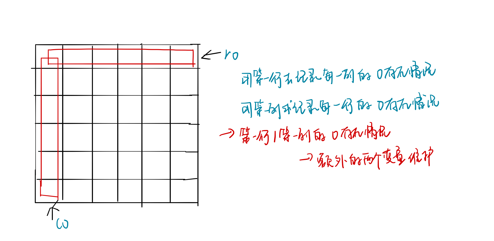

<!--
 * @Description: 
 * @Versions: 
 * @Author: Vernon Cui
 * @Github: https://github.com/vernon97
 * @Date: 2020-11-29 18:13:53
 * @LastEditors: Vernon Cui
 * @LastEditTime: 2020-11-30 21:12:14
 * @FilePath: /Leetcode-notes/week08.md
-->
# Week 08 - Leetcode 71 - 80

#### 71 - 简化路径

模拟题， 这里相当于把string 当栈来用，遇到`..` 就把上一个name弹出来；

```cpp
class Solution {
public:
    string simplifyPath(string path) {
        string res, name;
        if(path.back() != '/') path += '/';
        for(auto c : path)
        {
            if(c != '/') name += c;
            else
            {
                if(name == "..")
                {
                    while(res.size() && res.back() != '/') res.pop_back(); // 除去上一个name
                    if(res.size()) res.pop_back(); // 除去 /
                }
                else if (name != "." && name.size())
                    res += '/' + name;     // 加在结果里
                name.clear();
            }
        }
        if(res.empty()) return "/"; // 如果res为空 -> 处于根目录
        else return res;
    }
};
```

#### 72 - 编辑距离 

```diff
+ DP
```

很**经典**的动态规划问题了；

`f[i][j] 表示 a[1..i] 到 b[1..j] 按顺序操作的最短编辑距离`

1. 不会有多余操作
2. 操作顺序不会影响答案

删除 `f[i - 1, j] + 1`
添加 `f[i, j - 1] + 1`
替换 `f[i - 1, j - 1] + 0 / 1` （取决于`a[i]` 和 `b[j]`是否相等）

初始化要稍微注意一下；

```cpp
class Solution {
public:
    int minDistance(string word1, string word2) {
        int n = word1.size(), m = word2.size();
        if(!n || !m) return n + m;
        word1 = " " + word1, word2 = " " + word2;
        vector<vector<int>> f(n + 1, vector<int>(m + 1));
        f[0][0] = 0;
        for(int i = 1; i <= n; i++)
            f[i][0] = i;
        for(int i = 1; i <= m; i++)
            f[0][i] = i;
        for(int i = 1; i <= n; i++)
            for(int j = 1; j <= m; j++)
            {
                f[i][j] = min(f[i - 1][j], f[i][j - 1]) + 1;
                if(word1[i] == word2[j])    f[i][j] = min(f[i][j], f[i - 1][j - 1]);
                else f[i][j] = min(f[i][j], f[i - 1][j - 1] + 1);
            }
        return f[n][m];
    }
};
```

#### 73 - 矩阵置0

行列互相影响 -> 先开两个数组去记录行 列是否出现过0， 然后再遍历一次赋值就好；这里的空间复杂度是`o(m + n)`

对于本题的常数空间，实际上就是利用原数组去记录；

> 用第一行去记录每一列是否出现过0， 第一列去记录每一行是否出现过0； 而第一行和第一列是否出现过0可以用额外的两个变量记录；

这样就保证了常数空间;


**空间：o(n + m)**

```cpp
class Solution {
public:
    void setZeroes(vector<vector<int>>& matrix) {
        // o(mn) 标记每个位置是否为0
        // o(m + n) 标记行 列 是否出现过0
        // 常数？ 如何在上面标记 -> 位运算?
        if(matrix.empty() || matrix[0].empty()) return;
        int n = matrix.size(), m = matrix[0].size();
        vector<bool> row(n, false), col(n, false);
        for(int i = 0; i < n; i++)
            for(int j = 0; j < m; j++)
                if(matrix[i][j] == 0)
                    row[i] = col[j] = true;
        
        for(int i = 0; i < n; i++)
            for(int j = 0; j < m; j++)
                if(row[i] || col[j])
                    matrix[i][j] = 0;
        return;
        
    }
};
```

**空间：o(1)**

```cpp
class Solution {
public:
    void setZeroes(vector<vector<int>>& matrix) {
        if(matrix.empty() || matrix[0].empty()) return;
        int n = matrix.size(), m = matrix[0].size();
        //vector<bool> row(n, false), col(n, false);
        bool r0 = false, c0 = false;
        for(int i = 0; i < n; i++)
            for(int j = 0; j < m; j++)
            {
                if(!i || !j)
                { 
                    if(!i) r0 = r0 || matrix[i][j] == 0;
                    if(!j) c0 = c0 || matrix[i][j] == 0;
                }
                else if (matrix[i][j] == 0) matrix[0][j] = matrix[i][0] = 0;  
            }
        for(int i = 1; i < n; i++)
            for(int j = 1; j < m; j++)
            {
                if(matrix[i][0] == 0 || matrix[0][j] == 0)
                    matrix[i][j] = 0;
            }
        if(r0) 
            for(int i = 0; i < m; i++) 
                matrix[0][i] = 0;
        if(c0)
            for(int i = 0; i < n; i++)
                matrix[i][0] = 0;
        return; 
    }
};
```

#### 74 - 搜索二维矩阵