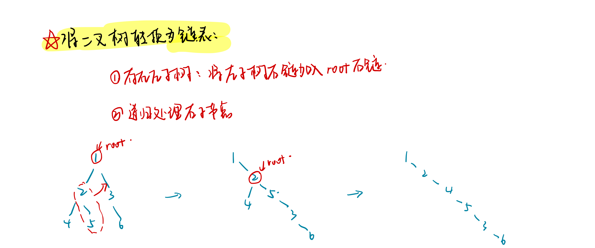

<!--
 * @Description: 
 * @Versions: 
 * @Author: Vernon Cui
 * @Github: https://github.com/vernon97
 * @Date: 2020-12-15 15:13:22
 * @LastEditors: Vernon Cui
 * @LastEditTime: 2020-12-15 20:18:51
 * @FilePath: /.leetcode/Users/vernon/Leetcode-notes/week12.md
-->
# Week 12 - Leetcode 111 - 120 

#### 111 - 二叉树的最小深度

```cpp
class Solution {
public:
    int minDepth(TreeNode* root) {
        if(root == nullptr) return 0;
        return dfs(root);
    }
    int dfs(TreeNode* root)
    {
        if(!root->left && !root->right) return 1; // 叶子节点
        int l = INT_MAX, r = INT_MAX; // 限制只有一侧为空的情况
        if(root->left)  l = dfs(root->left);
        if(root->right) r = dfs(root->right);
        return min(l, r) + 1; 
    }
};
```

#### 112 - 路径总和

注意终点一定要是叶子节点；

```cpp
class Solution {
public:
    bool hasPathSum(TreeNode* root, int sum) {
        if(root == nullptr) return false;
        if(root->left == nullptr && root->right == nullptr) return sum == root->val;
        return hasPathSum(root->left, sum - root->val) || hasPathSum(root->right, sum - root->val);
    }
};
```

#### 113 - 路径总和ii

同样是dfs 记录方案 

```cpp
class Solution {
public:
    vector<vector<int>> res;
public:
    vector<vector<int>> pathSum(TreeNode* root, int sum) {
        vector<int> path;
        dfs(root, sum, path);
        return res;
    }
    void dfs(TreeNode* root, int sum, vector<int>& path)
    {
        if(root == nullptr) return;
        if(root->left == nullptr && root->right == nullptr)
        {
            if(sum == root->val)
            {
                path.push_back(root->val);
                res.push_back(path);
                path.pop_back();
            }
            return;
        }
        path.push_back(root->val);
        dfs(root->left,  sum - root->val, path);
        dfs(root->right, sum - root->val, path);
        path.pop_back();
    }
};
```

#### 114 - 二叉树展开为链表



```cpp
class Solution {
public:
    void flatten(TreeNode* root) {
        if(root == nullptr) return;
        if(root->left)
        {
            TreeNode* root_left_tmp = root->left, *root_right_tmp = root->right;
            root->left = nullptr;
            root->right = root_left_tmp;
            while(root->right)
                root = root->right;
            root->right = root_right_tmp;
            flatten(root_left_tmp);
        }
        else
            flatten(root->right);
    }
};
```

#### 115 - 不同的子序列

经典的两个字符串的动态规划问题；

> 状态表示： `f[i, j]` 表示`s[1..i]`与`t[1..j]`中满足子序列的方案数
> 状态计算： 分为选择当前`s[i]`和不选择两个方案

```cpp
typedef unsigned long long ULL;
class Solution {
public:
    int numDistinct(string s, string t) {
        int n = s.size(), m = t.size();
        vector<vector<ULL>> f(n + 1, vector<ULL>(m + 1));
        s = ' ' + s, t = ' ' + t;
        for(int i = 0; i <= n; i++)
            f[i][0] = 1;
        for(int j = 1; j <= m; j++)
            for(int i = 1; i <= n; i++)
            {
                // 不选择当前s[i]
                f[i][j] += f[i - 1][j];
                // 如果字符一致 加上选择当前s[i]的方案数
                if(s[i] == t[j]) f[i][j] += f[i - 1][j - 1];
            }
        return static_cast<int>(f[n][m]);
    }
};
```