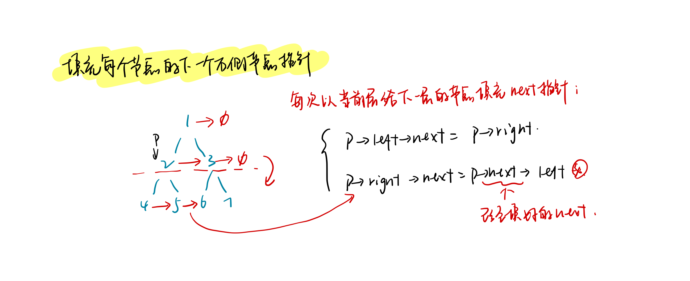

<!--
 * @Description: 
 * @Versions: 
 * @Author: Vernon Cui
 * @Github: https://github.com/vernon97
 * @Date: 2020-12-15 15:13:22
 * @LastEditors: Vernon Cui
 * @LastEditTime: 2020-12-15 22:06:50
 * @FilePath: /.leetcode/Users/vernon/Leetcode-notes/week12.md
-->
# Week 12 - Leetcode 111 - 120 

#### 111 - 二叉树的最小深度

```cpp
class Solution {
public:
    int minDepth(TreeNode* root) {
        if(root == nullptr) return 0;
        return dfs(root);
    }
    int dfs(TreeNode* root)
    {
        if(!root->left && !root->right) return 1; // 叶子节点
        int l = INT_MAX, r = INT_MAX; // 限制只有一侧为空的情况
        if(root->left)  l = dfs(root->left);
        if(root->right) r = dfs(root->right);
        return min(l, r) + 1; 
    }
};
```

#### 112 - 路径总和

注意终点一定要是叶子节点；

```cpp
class Solution {
public:
    bool hasPathSum(TreeNode* root, int sum) {
        if(root == nullptr) return false;
        if(root->left == nullptr && root->right == nullptr) return sum == root->val;
        return hasPathSum(root->left, sum - root->val) || hasPathSum(root->right, sum - root->val);
    }
};
```

#### 113 - 路径总和ii

同样是dfs 记录方案 

```cpp
class Solution {
public:
    vector<vector<int>> res;
public:
    vector<vector<int>> pathSum(TreeNode* root, int sum) {
        vector<int> path;
        dfs(root, sum, path);
        return res;
    }
    void dfs(TreeNode* root, int sum, vector<int>& path)
    {
        if(root == nullptr) return;
        if(root->left == nullptr && root->right == nullptr)
        {
            if(sum == root->val)
            {
                path.push_back(root->val);
                res.push_back(path);
                path.pop_back();
            }
            return;
        }
        path.push_back(root->val);
        dfs(root->left,  sum - root->val, path);
        dfs(root->right, sum - root->val, path);
        path.pop_back();
    }
};
```

#### 114 - 二叉树展开为链表


```cpp
class Solution {
public:
    void flatten(TreeNode* root) {
        if(root == nullptr) return;
        if(root->left)
        {
            TreeNode* root_left_tmp = root->left, *root_right_tmp = root->right;
            root->left = nullptr;
            root->right = root_left_tmp;
            while(root->right)
                root = root->right;
            root->right = root_right_tmp;
            flatten(root_left_tmp);
        }
        else
            flatten(root->right);
    }
};
```

#### 115 - 不同的子序列

经典的两个字符串的动态规划问题；

> 状态表示： `f[i, j]` 表示`s[1..i]`与`t[1..j]`中满足子序列的方案数
> 状态计算： 分为选择当前`s[i]`和不选择两个方案

```cpp
typedef unsigned long long ULL;
class Solution {
public:
    int numDistinct(string s, string t) {
        int n = s.size(), m = t.size();
        vector<vector<ULL>> f(n + 1, vector<ULL>(m + 1));
        s = ' ' + s, t = ' ' + t;
        for(int i = 0; i <= n; i++)
            f[i][0] = 1;
        for(int j = 1; j <= m; j++)
            for(int i = 1; i <= n; i++)
            {
                // 不选择当前s[i]
                f[i][j] += f[i - 1][j];
                // 如果字符一致 加上选择当前s[i]的方案数
                if(s[i] == t[j]) f[i][j] += f[i - 1][j - 1];
            }
        return static_cast<int>(f[n][m]);
    }
};
```

#### 116 - 填充每个节点的下一个右侧节点指针

这题不要求常数空间的话，就是一个层序遍历的问题，和下一题的代码一样；

1. 层序遍历版

```cpp
class Solution {
public:
    Node* connect(Node* root) {
        queue<Node*> q;
        if(!root) return root;
        q.push(root);
        while(q.size())
        {
            int len = q.size();
            while(len--)
            {
                auto t = q.front();
                q.pop();
                if(t->left)  q.push(t->left);
                if(t->right) q.push(t->right);
                if(len) t->next = q.front();
            }

        }
        return root;
    }
};
```

如果要求常数空间的话，就要把next指针利用上完成层序遍历， 这里是通过当前层给下一层填写next指针



2. 常数空间版

```cpp
class Solution {
public:
    Node* connect(Node* root) {
        // 感觉是层序遍历套壳
        queue<Node*> q;
        if(!root) return root;
        Node* cur_root = root;
        while(cur_root->left)
        {
            for(Node* p = cur_root; p; p = p->next)
            {
                p->left->next  = p->right; // 左节点的next是右节点
                if(p->next) p->right->next = p->next->left; // 右节点的next是root的next的左节点
            }
            cur_root = cur_root->left;
        }
        return root;
    }
};
```

#### 117 - 填充每个节点的下一个右侧节点指针ii

相较于上一题的满二叉树，这里就没有这么好的性质了，需要手动维护链表的头尾节点；
当然本题的代码上一题也能用了

```cpp
class Solution {
public:
    Node* connect(Node* root) {
        if(root == nullptr) return root;
        Node* cur_root = root;
        while(cur_root)
        {
            Node* tail = nullptr, *head = nullptr;
            for(Node* p = cur_root; p; p = p->next)
            {
                if(p->left)
                {
                    if(tail == nullptr)
                        tail = p->left, head = tail;
                    else
                        tail = tail->next = p->left;
                }
                if(p->right)
                {
                    if(tail == nullptr)
                        tail = p->right, head = tail;
                    else
                        tail = tail->next = p->right;
                }
            }
            cur_root = head;
        }
        return root;
    }
};
```

#### 118 - 杨辉三角

```cpp
class Solution {
public:
    vector<vector<int>> generate(int numRows) {
        // 数字三角形 动态规划
        vector<vector<int>> res;
        if(!numRows) return res;
        for(int i = 1; i <= numRows; i++)
        {
            vector<int> level;
            level.push_back(1);
            if(i > 2) 
            {
                vector<int>& last = res.back(); 
                for(int j = 1; j < i - 1; j++)
                    level.push_back(last[j - 1] + last[j]);
            }
            if(i > 1) level.push_back(1);
            res.push_back(move(level));
        }
        return res;
    }
};
```

#### 119 - 杨辉三角ii

节省空间就用翻转数组

```cpp
class Solution {
public:
    vector<int> getRow(int rowIndex) {
        vector<vector<int>> f(2, vector<int>(rowIndex + 1));
        vector<int> res;
        for(int i = 1; i <= rowIndex + 1; i++)
        {
            vector<int>& prev = f[i % 2], &cur = f[1 - (i % 2)];
            cur[0] = 1;
            if(i > 2)
            {
                for(int j = 1; j < i; j++)
                    cur[j] = prev[j - 1] + prev[j];
            }
            cur[i - 1] = 1;
        }
        return f[rowIndex % 2];
    }
};
```
