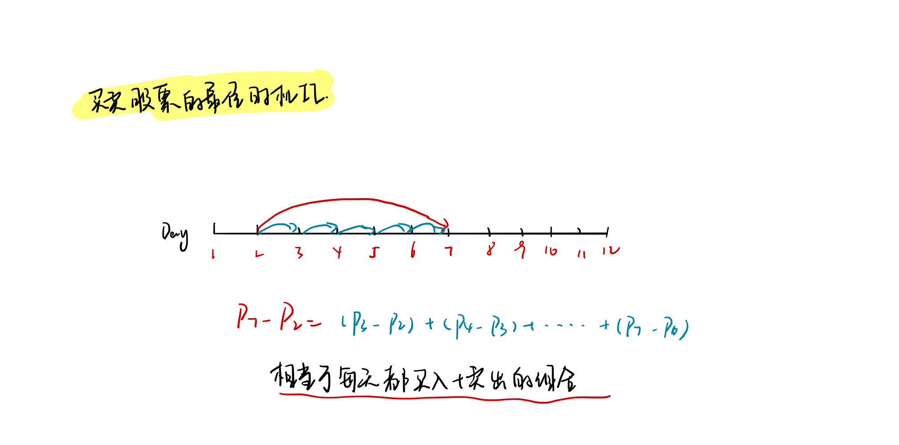
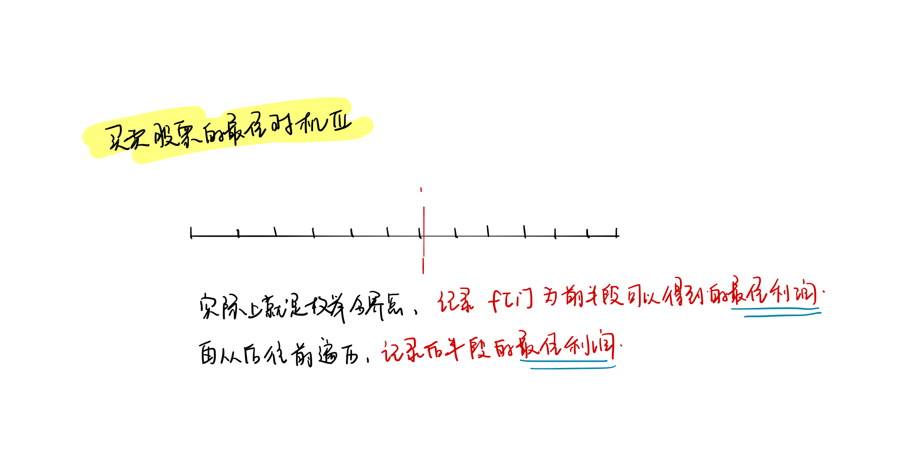

<!--
 * @Description: 
 * @Versions: 
 * @Author: Vernon Cui
 * @Github: https://github.com/vernon97
 * @Date: 2020-12-15 23:30:24
 * @LastEditors: Vernon Cui
 * @LastEditTime: 2020-12-18 21:31:56
 * @FilePath: /.leetcode/Users/vernon/Leetcode-notes/week13.md
-->
# Week 13 - Leetcode 121 - 130

#### 121 - 买卖股票的最佳时机

记录从 `1 ~ i - 1` 的价值最小值买入， 当前卖出的价值，维护其最大值即可；

```cpp
class Solution {
public:
    int maxProfit(vector<int>& prices) {
        int minv = 2e9, res = 0;
        for(auto p : prices)
        {
            res = max(res, p - minv);
            minv = min(minv, p);
        }
        return res;
    }
};
```

#### 122 - 买卖股票的最佳时机ii



__长交易分解__ 把一整段交易可以拆成每天买入每天卖出， 然后组合即为所有交易的情况；

所以最后最大的盈利 就是将每一天卖出买入为正的所有情况加起来；


```cpp
class Solution {
public:
    int maxProfit(vector<int>& prices) {
        int res = 0;
        for(int i = 0; i + 1 < prices.size(); i++)
            res += max(0, prices[i + 1] - prices[i]);
        return res;
    }
};
```

#### 123 - 买卖股票的最佳时机iii

这题当然可以用DP去做了， **但是可以对于这种分成两段的问题，可以枚举中间的分界点，前后缀分离来完成；**



先遍历一遍记录前半段的最大利润`f[i]`, 再从后往前遍历 求得后半段的最大值即可；

```cpp
class Solution {
public:
    int maxProfit(vector<int>& prices) {
        // 最多可以完成两笔交易 -> 枚举两次交易的分界点 前后缀分解
        int n = prices.size();
        vector<int> f(n + 2);
        for(int i = 1, minp = INT_MAX; i <= n; i++)
        {
            f[i] = max(f[i - 1], prices[i - 1] - minp);
            minp = min(minp, prices[i - 1]);
        }
        int res = 0;
        for(int i = n, maxp = 0; i; i--)
        {
            res = max(res, maxp - prices[i - 1] + f[i - 1]);
            maxp = max(maxp, prices[i - 1]);
        }
        return res;
    }
};
```

#### 124 - 二叉树的最大路径和

一般树🌲中枚举路径 都是枚举最高点 （LCA 最近公共祖先）

再去找左子树最大路径和，右子树的最大路径和 （因为两边独立）

这样dfs的返回值是沿着当前节点往下走的最大路径和：三种情况 当前点停下， 向左走， 向右走

并维护一个全局的答案 记录左右两边和的最大值；

这里左右两边都是可选可不选的；

```cpp
class Solution {
public:
    int res = INT_MIN;
public:
    int dfs(TreeNode* root) {
        if(root == nullptr) return 0;
        int l = dfs(root->left);
        int r = dfs(root->right);
        //res = max(res, l + r + root->val); // 这是不对的 左右都可以不选
        res = max(res, root->val);
        res = max(res, root->val + l);
        res = max(res, root->val + r);
        res = max(res, root->val + l + r);
        return max(0, max(l, r)) + root->val;
    }
    int maxPathSum(TreeNode* root)
    {
        dfs(root);
        return res;
    }
};
```

#### 125 - 验证回文串

基础双指针遍历, 记一下几个字符的库函数

> isdigit: 判断字符是否是0-9的数字
> 
> isalpha: 判断字符是否是字符 大小写都行
> 
> isalnum: 上面两个的综合
> 
> tolower/toupper: 大小写字符转换，不是字母的话会直接返回传入的字符

```cpp
class Solution {
public:
    bool isPalindrome(string s) {
        int l = 0, r = s.size() - 1;
        while(l < r)
        {
            while(l < r && !isalnum(s[l])) l++;
            while(l < r && !isalnum(s[r])) r--;
            if(l < r && tolower(s[l]) != tolower(s[r])) return false;
            l++, r--;
        }
        return true;
    }
};
```

#### 126 - 单词接龙ii

实际上是图论上的最短路问题，各边权都是1 -> `bfs` 可以解决

重点在建图上，这里图的构建用中间状态来代表 `abc -> a*c` 表示替换字母后的状态

建图方式有两种： 两两枚举是否能建边（n^2xL) 或者 枚举每个单词的每个字母 (26xnxL) 这里我们采用枚举每个单词的每个字母，用一个中间状态表示；

最后复习一下**最短路如何记录方案**： 首先记录每个点到终点的最短距离，然后枚举邻接表

如果满足`dist[t] + 1 = dist[next]` 就证明从t到next的这一段在最短路上， dfs搜索记录就可以了；

```cpp
class Solution {
public:
    vector<vector<string>> res;
    unordered_map<string, vector<string>> states;
    unordered_map<string, int> dist;
    string endWord;
    int n;
public:
    vector<vector<string>> findLadders(string beginWord, string endWord, vector<string>& wordList) {
        // 1. 初始化
        this->endWord = endWord;
        n = beginWord.size();
        for(auto word: wordList)
            for(int i = 0; i < n; i++)
            {
                string s = word.substr(0, i) + '*' + word.substr(i + 1);
                states[s].push_back(word);
            }
        for(int i = 0; i < n; i++)
        {
            string s = beginWord.substr(0, i) + '*' + beginWord.substr(i + 1);
            states[s].push_back(beginWord);
        }
        // 2. BFS 找最短距离 注意这里搜要从end往begin搜 方便后面记录方案
        if(find(wordList.begin(), wordList.end(), endWord) == wordList.end()) return res;
        queue<string> q;
        q.push(endWord);
        dist[endWord] = 0;
        while(q.size())
        {
            auto t = q.front();
            q.pop();
            for(int i = 0; i < n; i++)
            {
                string s = t.substr(0, i) + '*' + t.substr(i + 1);
                for(auto& x : states[s])
                {
                    if(dist.count(x)) continue;
                    dist[x] = dist[t] + 1;
                    if(x == beginWord) break;
                    q.push(x);
                }
            }
        }
        // 没找到最短路 ->
        if(!dist.count(beginWord)) return res;
        // 3. 从begin 根据记录的距离搜索 是否在最短路径上；
        // dist[x] = dist[t] + 1; 证明在最短路上
        vector<string> path;
        path.push_back(beginWord);
        dfs(beginWord, wordList, path);
        return res;
    }
    void dfs(string word, vector<string>& wordList, vector<string>& path)
    {
        if(word == endWord)
            res.push_back(path);
        else
        {
            for(int i = 0; i < n; i++)
            {
                string s = word.substr(0, i) + '*' + word.substr(i + 1);
                for(auto& x : states[s])
                    if(dist[x] + 1 == dist[word])
                    {
                        path.push_back(x);
                        dfs(x, wordList, path);
                        path.pop_back();
                    }
            }
        }
    }
};
```

#### 127 - 单词接龙

这题不用记录方案 直接抄上面题的代码也是可以的，但不用记录方案还是搞双向广搜会快一些(好像也没有快)

```cpp
class Solution {
public:
    int n;
    unordered_map<string, unordered_set<string>> states;
public:
    int extend(queue<string>& q, unordered_map<string, int>& da, unordered_map<string, int>& db)
    {
        string t = q.front();
        q.pop();
        for(int i = 0; i < n; i++)
        {
            string pattern = t.substr(0, i) + '*' + t.substr(i + 1);
            for(string state:states[pattern])
            {
                if(da.count(state)) continue;
                if(db.count(state)) return 1 + db[state] + da[t]; 
                da[state] = da[t] + 1;
                q.push(state);
            }
        }
        return 0;
    }
    int ladderLength(string beginWord, string endWord, vector<string>& wordList) {
        if(find(wordList.begin(),wordList.end(), endWord) == wordList.end()) return 0;
        n = beginWord.size();
        // 预处理可以变换的状态 助理状态集里没有beginWord 要手动加上
        for(string word: wordList)
            for(int i = 0; i < n; i++)
            {
                string state = word.substr(0, i) + '*' + word.substr(i + 1);
                //cout << word << ' ' << state << endl;
                states[state].insert(word);
            }
        // beginWord
        for(int i = 0; i < n; i++)
        {
            string state = beginWord.substr(0, i) + '*' + beginWord.substr(i + 1);
            states[state].insert(beginWord);
        }
        queue<string> qa, qb;
        unordered_map<string, int> da, db;
        qa.push(beginWord), da[beginWord] = 0;
        qb.push(endWord), db[endWord] = 1;
        int x = 0;
        while(qa.size() && qb.size())
        {
            if(qa.size() < qb.size())
                x = extend(qa, da, db);
            else
                x = extend(qb, db, da);
            if(x > 0)
                return x; 
        }
        return 0;
    }
};
```
