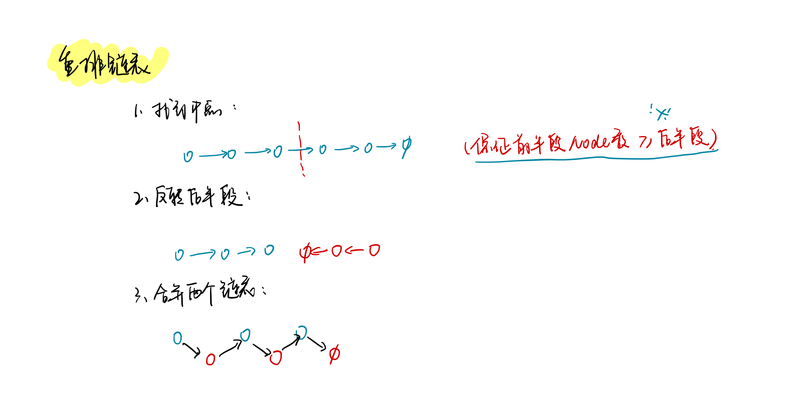

<!--
 * @Description: 
 * @Versions: 
 * @Author: Vernon Cui
 * @Github: https://github.com/vernon97
 * @Date: 2020-12-28 19:42:14
 * @LastEditors: Vernon Cui
 * @LastEditTime: 2020-12-28 21:29:40
 * @FilePath: /.leetcode/Users/vernon/Leetcode-notes/week15.md
-->
# Week 15 - Leetcode 141 - 150 

#### 141 - 环形链表

经典的快慢指针, 快指针每次走两步，慢指针每次走一步，如果他们能相遇说明一定有环；

```cpp
class Solution {
public:
    bool hasCycle(ListNode *head) {
        ListNode* slow = head, *fast = head;
        while(fast && fast->next)
        {
            slow = slow->next;
            fast = fast->next->next;
            if(slow == fast)
                return true;
        }
        return false;
    }
};
```

#### 142 - 环形链表II

在上一题判断有没有环的基础上，找到入口 实际上就是要额外记录环的长度，这样让双指针中的一个指针提前与另一个指针环的长度，则他们再次相遇的时候一定是环的起点；

```cpp
class Solution {
public:
    ListNode *detectCycle(ListNode *head) {
        ListNode* slow = head, *fast = head;
        bool flag = false;
        // 1. 判断是否有环
        while(fast && fast->next)
        {
            slow = slow->next;
            fast = fast->next->next;
            if(slow == fast)
            {
                flag = true;
                break;
            }
        }
        if(!flag) return nullptr;
        // 2. 记录环的长度 并让cur比head提前走 环那么长的指针
        // 这样他们再次相遇的时候一定就是起点
        ListNode* cur = head;
        do
        {
            slow = slow->next;
            cur = cur->next;
        }while(slow != fast);
        // 3. cur 比 head 提前了一整个环的长度 同时走 直到相遇 就是起点
        while(cur != head)
        {
            cur = cur->next;
            head = head->next;
        }
        return head;
    }
};
```

#### 143 - 重排链表


注意的点就在这个如何保证左半段链表node个数大于等于右边上了

```cpp
class Solution {
public:
    void reorderList(ListNode* head) {
        if(!head) return;
        // 1. 找到中点 （注意这里的边界）-> 快慢指针
        ListNode* a = head, *b = head->next; // 在这
        while(b && b->next)
        {
            a = a->next;
            b = b->next->next;
        }
        b = a->next;
        // 2. 链表反转
        a->next = nullptr;
        while(b)
        {
            ListNode* tmp_b_next = b->next;
            b->next = a;
            a = b, b = tmp_b_next;
        } 
        // 3. 两个链表重排
        // 此时 一个头结点是head， 一个头结点是a
        b = head;
        while(a && b)
        {
            ListNode* tmp_b_next = b->next, *tmp_a_next = a->next;
            b->next = a;
            b = a->next = tmp_b_next;
            a = tmp_a_next;
        }
    }
};
```