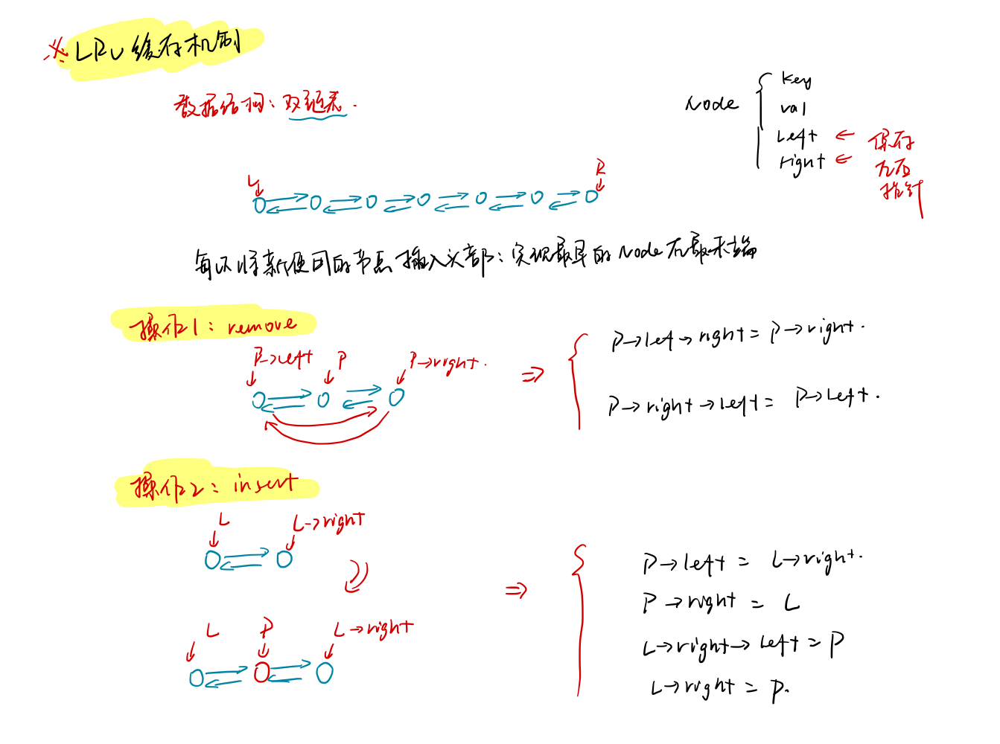

<!--
 * @Description: 
 * @Versions: 
 * @Author: Vernon Cui
 * @Github: https://github.com/vernon97
 * @Date: 2020-12-28 19:42:14
 * @LastEditors: Vernon Cui
 * @LastEditTime: 2020-12-29 21:16:10
 * @FilePath: /.leetcode/Users/vernon/Leetcode-notes/week15.md
-->
# Week 15 - Leetcode 141 - 150 

#### 141 - 环形链表

经典的快慢指针, 快指针每次走两步，慢指针每次走一步，如果他们能相遇说明一定有环；

```cpp
class Solution {
public:
    bool hasCycle(ListNode *head) {
        ListNode* slow = head, *fast = head;
        while(fast && fast->next)
        {
            slow = slow->next;
            fast = fast->next->next;
            if(slow == fast)
                return true;
        }
        return false;
    }
};
```

#### 142 - 环形链表II

在上一题判断有没有环的基础上，找到入口 实际上就是要额外记录环的长度，这样让双指针中的一个指针提前与另一个指针环的长度，则他们再次相遇的时候一定是环的起点；

```cpp
class Solution {
public:
    ListNode *detectCycle(ListNode *head) {
        ListNode* slow = head, *fast = head;
        bool flag = false;
        // 1. 判断是否有环
        while(fast && fast->next)
        {
            slow = slow->next;
            fast = fast->next->next;
            if(slow == fast)
            {
                flag = true;
                break;
            }
        }
        if(!flag) return nullptr;
        // 2. 记录环的长度 并让cur比head提前走 环那么长的指针
        // 这样他们再次相遇的时候一定就是起点
        ListNode* cur = head;
        do
        {
            slow = slow->next;
            cur = cur->next;
        }while(slow != fast);
        // 3. cur 比 head 提前了一整个环的长度 同时走 直到相遇 就是起点
        while(cur != head)
        {
            cur = cur->next;
            head = head->next;
        }
        return head;
    }
};
```

#### 143 - 重排链表


注意的点就在这个如何保证左半段链表node个数大于等于右边上了

```cpp
class Solution {
public:
    void reorderList(ListNode* head) {
        if(!head) return;
        // 1. 找到中点 （注意这里的边界）-> 快慢指针
        ListNode* a = head, *b = head->next; // 在这
        while(b && b->next)
        {
            a = a->next;
            b = b->next->next;
        }
        b = a->next;
        // 2. 链表反转
        a->next = nullptr;
        while(b)
        {
            ListNode* tmp_b_next = b->next;
            b->next = a;
            a = b, b = tmp_b_next;
        } 
        // 3. 两个链表重排
        // 此时 一个头结点是head， 一个头结点是a
        b = head;
        while(a && b)
        {
            ListNode* tmp_b_next = b->next, *tmp_a_next = a->next;
            b->next = a;
            b = a->next = tmp_b_next;
            a = tmp_a_next;
        }
    }
};
```

#### 144 - 二叉树的前序遍历

> 总结在后面

```cpp
class Solution {
public:
    vector<int> preorderTraversal(TreeNode* root) {
        vector<int> res;
        stack<TreeNode*> stk;
        while(root || stk.size())
        {
            while(root)
            {
                res.push_back(root->val);
                stk.push(root);
                root = root->left;
            }
            root = stk.top()->right;
            stk.pop();
        }
        return res;
    }
};
```

#### 145 - 二叉树的后序遍历

```cpp
class Solution {
public:
    vector<int> postorderTraversal(TreeNode* root) {
        vector<int> res;
        stack<TreeNode*> stk;
        while(root || stk.size())
        {
            while(root)
            {
                res.push_back(root->val);
                stk.push(root);
                root = root->right;
            }
            root = stk.top()->left;
            stk.pop();
        }
        reverse(res.begin(), res.end());
        return res;
    }
};
```

在这里复习一下迭代写法的二叉树前序 中序 后序遍历

前序遍历和中序遍历很像，前序：根左右， 中序：左根右

这里都是通过栈来模拟递归调用的过程，尽可能去遍历左子树， 只要有左子树就插入到栈内；

唯一的区别就是根节点是加入时处理 还是弹出时处理，这里要区分一下代码

```diff
+ 前序遍历
```

```cpp
class Solution {
public:
    vector<int> preorderTraversal(TreeNode* root) {
        vector<int> res;
        stack<TreeNode*> stk;
        while(root || stk.size())
        {
            while(root)
            {
                // 直接处理root
                res.push_back(root->val);
                stk.push(root);
                root = root->left;
            }
            root = stk.top()->right;
            stk.pop();
        }
        return res;
    }
};
```

```diff
+ 中序遍历
```

```cpp
class Solution {
public:
    vector<int> preorderTraversal(TreeNode* root) {
        vector<int> res;
        stack<TreeNode*> stk;
        while(root || stk.size())
        {
            while(root)
            {
                stk.push(root);
                root = root->left;
            }
            root = stk.top()
            res.push_back(root->val);
            stk.pop();
            // 处理right
            root = root->right;
        }
        return res;
    }
};
```

后序遍历的实现就不太一样了 主要是有一个反序的过程；

这里利用前序遍历类似的方法，我们预先得到 **根右左**的遍历结果，再反序即可；

```diff
+ 后序遍历
```

```cpp
class Solution {
public:
    vector<int> postorderTraversal(TreeNode* root) {
        vector<int> res;
        stack<TreeNode*> stk;
        while(root || stk.size())
        {
            while(root)
            {
                res.push_back(root->val);
                stk.push(root);
                root = root->right;
            }
            root = stk.top()->left;
            stk.pop();
        }
        reverse(res.begin(), res.end());
        return res;
    }
};
```

#### 146 - LRU 缓存机制

```diff
+ 这个题考的还挺多的
```

**LRU （Least Recently Used）缓存机制**

- 在缓存满的时候，删除缓存里最久未使用的数据，然后再放入新元素；
- 数据的访问时间很重要，访问时间距离现在最近，就最不容易被删除。

`int get(int key)` 如果关键字 `key` 存在于缓存中，则返回关键字的值，否则返回 `-1` 
`void put(int key, int value)` 如果关键字已经存在，则变更其数据值；如果关键字不存在，则插入该组**关键字-值**。当缓存容量达到上限时，它应该在写入新数据之前删除最久未使用的数据值，从而为新的数据值留出空间。
 
这两个操作应该是`o(1)`的 

用到的数据结构: **双链表**



```cpp
class LRUCache {
public:
    struct Node
    {
        int key, val;
        Node *left, *right;
        Node(int _key, int _val) : key(_key), val(_val), left(nullptr), right(nullptr) {}
    }*L, *R;
    unordered_map<int, Node*> hash;
    int n;
public:
    LRUCache(int capacity) {
        n = capacity;
        // 双链表 定义两个左右端点
        L = new Node(-1, -1), R = new Node(-1, -1);
        L->right = R, R->left = L;
    }
    
    int get(int key) {
        if(!hash.count(key)) return -1;
        Node* p = hash[key];
        remove(p); // 删除
        insert(p); // 插入到头部 
        return p->val;
    }
    
    void put(int key, int value) {
        if(hash.count(key))
        {
            Node* p = hash[key];
            p->val = value;
            remove(p);
            insert(p);
        }
        else
        {
            if(hash.size() == n)
            {
                Node* p = R->left;
                remove(p);
                hash.erase(p->key);
                delete p;
            }
            Node* p = new Node(key, value);
            hash[key] = p;
            insert(p);
        }
    }

    void remove(Node* p)
    {
        p->right->left = p->left;
        p->left->right = p->right;
    }
    void insert(Node* p)
    {
        p->right = L->right;
        p->left = L;
        L->right->left = p;
        L->right = p;
    }
};
```