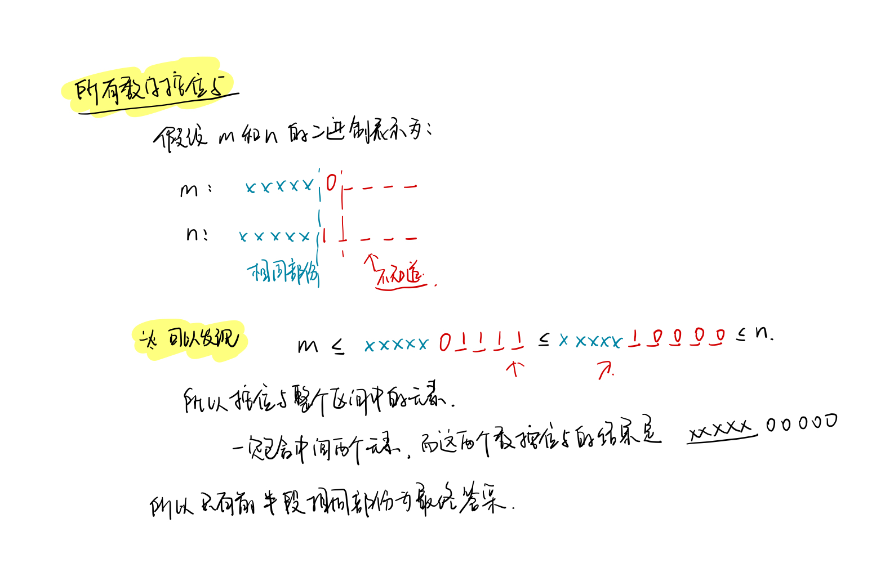

<!--
 * @Description: 
 * @Versions: 
 * @Author: Vernon Cui
 * @Github: https://github.com/vernon97
 * @Date: 2021-01-07 17:11:38
 * @LastEditors: Vernon Cui
 * @LastEditTime: 2021-01-07 21:36:29
 * @FilePath: /.leetcode/Users/vernon/Leetcode-notes/week21.md
-->

# Week 21 - Leetcode 201 - 210

#### 201 - 数字范围按位与



代码就是找到那个分界线 把后面的都置0 即可(先左移再右移)

```cpp
class Solution {
public:
    int rangeBitwiseAnd(int m, int n) {
        if(m == n) return m;
        for(int i = 30; i >= 0; i--)
        {
            if(!(m >> i & 1) && (n >> i & 1))
            {
                return m >> i << i;

            }
        }
        return 0;
    }
};
```

#### 202 - 快乐数

感觉是简单模拟.jpg 

其实也是链表判断有无环的问题，但本题最后结果为1 仅有1自环的可能，如果遇到重复元素且不是1的话 一定是无限循环的；

1. 哈希版

```cpp
class Solution {
public:
    bool isHappy(int n) {
        unordered_set<int> path;
        // * 只要遇到一样的数 就证明是无限循环;
        while(n != 1)
        {
            if(path.count(n)) return false;
            path.insert(n);
            int nval = 0;
            while(n)
            {
                nval += (n % 10) * (n % 10);
                n /= 10;
            }
            n = nval;
        }
        return true;
    }
};
```

2. 快慢指针版
   
```cpp
class Solution {
publioc:
    bool isHappy(int n)
    {
        int slow = n, fast = get(n);
        while(fast != slow)
        {
            fast = get(get(fast));
            slow = get(slow);
        }
        return fast == 1;
    }
    int get(int x)
    {
        int res = 0;
        while(x)
        {
            res += (x % 10) * (x % 10);
            x /= 10;
        }
        return res;
    }
}
```


#### 203 - 移除链表元素

注意的点就在 会有连续删除的情况 所以删完一个元素不能直接指next

```cpp
class Solution {
public:
    ListNode* removeElements(ListNode* head, int val) {
        // 链表删除节点 要知道前驱结点才行, 所以要新建dummy
        ListNode* dummy = new ListNode(10086), *cur = dummy;
        dummy->next = head;
        while(cur && cur->next)
        {
            if(cur->next->val == val)
                cur->next = cur->next->next;
            else
                cur = cur->next;
        }
        return dummy->next;
    }
};
```

#### 204 - 计数质数

```diff
+ 数论
```

线性筛马上拿出来背一遍， 数论确实很难见到 原谅自己忘了hh

> 质数定理: 在x -> +inf 时候， 0 ~ x 质数的个数 ~ x/ln(x)

提到算质数肯定就是线性筛了，线性筛保证每个数字只会被筛一次 所以时间复杂度是`o(n)`的；

**线性筛保证每个合数都只被他的最小质因子筛掉一次** -> 是往后筛

（这里是包括n的）

```cpp
class Solution {
public:
    int countPrimes(int n) {
        if(n <= 2) return 0;
        vector<int> primes;
        vector<bool> st(n);
        for(int i = 2; i <= n; i++)
        {
            // 1. 没被筛掉 -> 则证明是质数
            if(!st[i]) primes.push_back(i);
            // 2. 往后筛 记住那个前提！ 线性筛保证每个合数都只会被其最小质因子筛掉一次
            for(int j = 0; primes[j] <= n / i; j++)
            {
                st[primes[j] * i] = true;
                if(i % primes[j] == 0) break;
            }
        }
        return primes.size();
    }
};
```

所以 在`i % primes[j] != 0` 的情况下 primes[j] 一定是最小质因子;
跳出条件就是`i % primes[j] == 0`;

记住就好了；

#### 205 - 同构字符串

模拟题：

有这两个条件:
> 每个出现的字符都应当映射到另一个字符，同时不改变字符的顺序。
> 不同字符不能映射到同一个字符上，相同字符只能映射到同一个字符上，字符可以映射到自己本身。

第一个条件用一个哈希表来存储`s->t`映射关系，第二个条件用一个set来存是否`t`的字符是否有被映射过

```cpp
class Solution {
public:
    bool isIsomorphic(string s, string t) {
        // 模拟题
        unordered_map<char, char> hash;
        unordered_set<char> seen;
        // if(s.size() != t.size()) return false; -> 题中假设长度相同
        for(int i = 0; i < t.size(); i++)
        {
            if(!hash.count(s[i]))
            {
                if(!seen.count(t[i]))
                {
                    hash[s[i]] = t[i];
                    seen.insert(t[i]);
                }
                else
                    return false;
                
            }
            else if(hash[s[i]] != t[i])
                return false;
        }
        return true;
    }
};
```