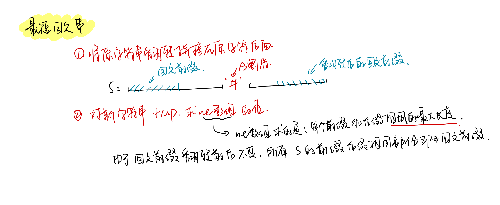

<!--
 * @Description: 
 * @Versions: 
 * @Author: Vernon Cui
 * @Github: https://github.com/vernon97
 * @Date: 2021-01-09 01:22:48
 * @LastEditors: Vernon Cui
 * @LastEditTime: 2021-01-10 22:34:23
 * @FilePath: /.leetcode/Users/vernon/Leetcode-notes/week22.md
-->
# Week 22 - Leetcode 211 - 220

#### 211 - 添加与搜索单词 - 数据结构设计

这题就是在Trie树的搜索结果上改一改，把通配符'.' 的搜索考虑进去；
由于通配符的存在，搜索改成递归形式的比较好一些；

```cpp
class WordDictionary {
public:
    struct Node
    {
        Node* son[26];
        bool is_end;
        Node()
        {
            is_end = false;
            for(int i = 0; i < 26; i++)
                son[i] = nullptr;
        }
    }*root;
    /** Initialize your data structure here. */
    WordDictionary() {
        root = new Node();
    }
    
    /** Adds a word into the data structure. */
    void addWord(string word) {
        auto p = root;
        for(auto c : word)
        {
            int u = c - 'a';
            if(!p->son[u]) p->son[u] = new Node();
            p = p->son[u];
        }
        p->is_end = true;
    }

    bool find_word(Node* p, string& word, int si)
    {
        if(si == word.size()) return p->is_end;
        if(word[si] == '.')
        {
            for(int i = 0; i < 26; i++)
                if(p->son[i] && find_word(p->son[i], word, si + 1))
                    return true;
        }
        else
        {    
            int u = word[si] - 'a';
            if(p->son[u]) return find_word(p->son[u], word, si + 1);   
            else return false;
        }
        return false;
    }
    
    /** Returns if the word is in the data structure. A word could contain the dot character '.' to represent any one letter. */
    bool search(string word) {
        return find_word(root, word, 0);
    }
};
```

#### 212 - 单词搜索II

单词搜索I 是啥来着 从二维网格搜一个单词

搜索II 搜多个单词 -> 构建Trie树

```cpp
class Solution {
public:
    struct Node
    {
        int id;
        Node* son[26];
        Node()
        {
            id = -1;
            for(int i = 0; i < 26; i++)
                son[i] = nullptr;
        }
    }*root;
    int n, m;
    int dx[4] = {1, 0, -1, 0}, dy[4] = {0, 1, 0, -1};
    vector<vector<char>> board;
    vector<vector<bool>> st;
    vector<string> res;
    unordered_set<int> findIds;
public:
    vector<string> findWords(vector<vector<char>>& board, vector<string>& words) {
        if(!board.size() || !board[0].size()) return res;
        root = new Node();
        n = board.size(), m = board[0].size();
        st = vector<vector<bool>>(n, vector<bool>(m));
        this->board = board;
        // * 1. 构建Trie树
        for(int i = 0; i < words.size(); i++)
        {
            Node* p = root;
            for(auto c : words[i])
            {
                int u = c - 'a';
                if(p->son[u] == nullptr) p->son[u] = new Node();
                p = p->son[u];
            }
            p->id = i;
        }
        // * 2. DFS (回溯)
        for(int i = 0; i < n; i++)
            for(int j = 0; j < m; j++)
            {
                int u = board[i][j] - 'a';
                if(root->son[u])
                {
                    st[i][j] = true;
                    dfs(i, j, root->son[u]);
                    st[i][j] = false;
                }
            }
        // * 3. 从id整理答案
        for(auto id : findIds)
            res.push_back(words[id]);
        return res;
    }
    void dfs(int sx, int sy, Node* p)
    {
        if(~(p->id))
            findIds.insert(p->id);
        for(int i = 0; i < 4; i++)
        {
            int x = sx + dx[i], y = sy + dy[i];
            if(x < 0 || x >= n || y < 0 || y >= m) continue;
            int u = board[x][y] - 'a';
            if(st[x][y]) continue;
            if(p->son[u] == nullptr) continue;
            st[x][y] = true;
            dfs(x, y, p->son[u]);
            st[x][y] = false;
        }
    }
};
```

效率比较低就是了.. 所以要用支持delete操作的trie树 (真的很难写...)

```cpp
class Trie
{
public:
    struct Node 
    {
        int id;
        int cnt;
        vector<Node*> son;
        Node(){
            id = -1;
            cnt = 0;
            son = vector<Node*>(26, nullptr);
        }
    }*root;

    Trie()
    {
        root = new Node();
    }
    void insert(string word, int id)
    {
        Node* p = root;
        for(auto c : word)
        {
            int u = c - 'a';
            if(p->son[u] == nullptr) p->son[u] = new Node(), p->cnt++;
            p = p->son[u];
        }
        p->id = id;
    }
    void remove(string word)
    {
        stack<Node*> stk;
        Node* p = root;
        stk.push(p);
        for(auto c : word)
        {
            int u = c - 'a';
            if(p->son[u] == nullptr) return;
            p = p->son[u];
            stk.push(p);
        }
        if(p->id == -1) return;
        if(p->cnt > 0) 
        {
            p->id = -1;
            return;
        }
        p->id = -1;
        int i = word.size() - 1;
        while(stk.size())
        {
            p = stk.top();
            stk.pop();
            if(p->cnt == 0 && p->id == -1)
            {
                stk.top()->cnt--;
                stk.top()->son[word[i--] - 'a'] = nullptr;
                //delete p;  在leetcode会有问题
            }
            else  break;
        }
    }
    bool search(string word)
    {
        Node* p = root;
        for(auto c : word)
        {
            int u = c - 'a';
            if(p->son[u] == nullptr)
                return false;     
            p = p->son[u]; 
        }
        return p->id != -1;
    }
};
```
这个时间复杂度真的差很多 


#### 213 - 打家劫舍II

复习一下Leetcode 198. 打家劫舍I;

那一题就是状态机模型的简单应用，用没偷0和偷了1记录状态；

这一题相较于上一题，成环相当于额外增加了一个限制条件：头尾不能同时偷;

所以我们就跑两次 `[1...n - 1]` 和 `[2...n]` 保证 1 和 n 不会同时被偷 最后返回两个中的最大值即可；


```cpp
class Solution {
public:
    int rob(vector<int>& nums) {
        int n = nums.size();
        if(n == 1) return nums[0];
        vector<int> f(n + 1, -2e9), g(n + 1, -2e9);
        f[0] = 0;
        int res = 0;
        for(int i = 1; i < n; i++)
        {
            f[i] = max(f[i - 1], g[i - 1]);
            g[i] = f[i - 1] + nums[i - 1];
        }
        res = max(res, max(f[n - 1], g[n - 1]));
        for(int i = 1; i < n; i++)
        {
            f[i] = max(f[i - 1], g[i - 1]);
            g[i] = f[i - 1] + nums[i];
        }
        res = max(res, max(f[n - 1], g[n - 1]));
        return res; 
    }
};
```

#### 214 - 最短回文串

```diff
+ KMP
```

这题一看就是KMP了， 很快啊就背一遍KMP

```cpp
vector<int> ne(n + 2);

for(int i = 2, j = 0; i <= m; i++)
{
    while(j && p[i] != p[j + 1]) j = ne[j];
    if(p[i] == p[j + 1]) j++;
    ne[i] = j;
}

for(int i = 1, j = 0; i <= n; i++)
{
    while(j && s[i] != p[j + 1]) j = ne[j];
    if(s[i] == p[j + 1]) j++;
    if(j == m)
    {
        j = ne[j];
        // 匹配成功的逻辑
    }
}
```

对于这个题而言 就是找到原字符串`s`的**最长回文前缀**

最长回文前缀常和KMP联系到一起，具体操作如下：



```cpp
class Solution {
public:
    string shortestPalindrome(string s) {
        // 1. 复制翻转串
        string rev_s(s.rbegin(), s.rend());
        string pattern = ' ' + s + '#' + rev_s;
        int n = pattern.size() - 1;
        vector<int> ne(n + 2);
        // 2. 求ne数组 找到最长回文前缀
        for(int i = 2, j = 0; i <= n; i++)
        {
            while(j && pattern[i] != pattern[j + 1]) j = ne[j];
            if(pattern[i] == pattern[j + 1]) j++;
            ne[i] = j;
        }
        return rev_s + s.substr(ne[n]);
    }
};
```

#### 215 - 数组中的第K个最大元素

快排 or 二分都可以解决这个问题
