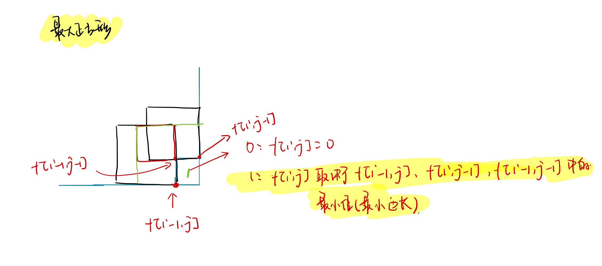
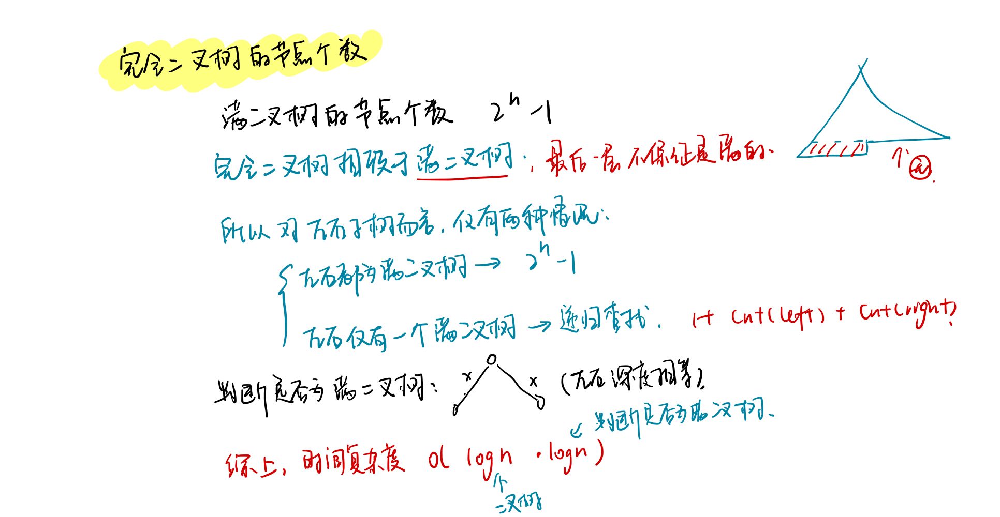

<!--
 * @Description: 
 * @Versions: 
 * @Author: Vernon Cui
 * @Github: https://github.com/vernon97
 * @Date: 2021-01-11 16:23:08
 * @LastEditors: Vernon Cui
 * @LastEditTime: 2021-01-12 19:45:31
 * @FilePath: /.leetcode/Users/vernon/Leetcode-notes/week23.md
-->
<!--
 * @Description: 
 * @Versions: 
 * @Author: Vernon Cui
 * @Github: https://github.com/vernon97
 * @Date: 2021-01-11 16:23:08
 * @LastEditors: Vernon Cui
 * @LastEditTime: 2021-01-11 22:25:24
 * @FilePath: /.leetcode/Users/vernon/Leetcode-notes/week23.md
-->

- [Week 23 - Leetcode 221 - 230](#week-23---leetcode-221---230)
      - [221 - 最大正方形](#221---最大正方形)
      - [222 - 完全二叉树的节点个数](#222---完全二叉树的节点个数)
      - [223 - 矩形面积](#223---矩形面积)
      - [224 - 基本计算器](#224---基本计算器)
      - [225 - 用队列实现栈](#225---用队列实现栈)

# Week 23 - Leetcode 221 - 230

#### 221 - 最大正方形

这题 是经典的动态规划了，要复习一下
（记住只有最大正方形是动态规划 最大矩形不是）

说着就来回顾一下最大矩形(Leetcode 85. 最大矩形) 的那个题是怎么做的； 按层遍历 + 单调栈

这题就是动态规划了, 动态规划就是见一个记一个hhh

> `f[i, j]` 表示以`(i, j)` 为右下角的最大正方形边长

`f[i, j] = min(f[i - 1, j], f[i, j - 1], f[i - 1, j - 1]) + 1`



代码没什么好说的 主要是这个状态转移方程很难想

```cpp
class Solution {
public:
    int maximalSquare(vector<vector<char>>& matrix) {
        if(matrix.empty() || matrix[0].empty()) return 0;
        int n = matrix.size(), m = matrix[0].size();
        vector<vector<int>> f(n + 1, vector<int>(m + 1, 0));

        int res = 0;
        for(int i = 1; i <= n; i++)
            for(int j = 1; j <= m; j++)
                if(matrix[i - 1][j - 1] == '1')
                {
                    f[i][j] = min(f[i - 1][j], min(f[i][j - 1], f[i - 1][j - 1])) + 1; 
                    res = max(res, f[i][j]);
                }
        return res * res;
    }
};
```

#### 222 - 完全二叉树的节点个数

只记得完全二叉树可以用数组模拟了.. 

完全二叉树 和 满二叉树的区别 别记成一样的就行了

**这题居然是二分？！**



```cpp
class Solution {
public:
    int countNodes(TreeNode* root) {
        if(!root) return 0;
        TreeNode* l = root->left, *r = root->right;
        int x = 1, y = 1;
        while(l) l = l->left,  x++;
        while(r) r = r->right, y++;
        if(x == y) return (1 << x) - 1;
        return 1 + countNodes(root->left) + countNodes(root->right);
    }

};
```

#### 223 - 矩形面积

平面两个线段`[A, B]` 和 `[C, D]`的重合部分：`min(B, D) - max(A, C)`

请注意这里即不用排序，也不必预先判断不重合的情况（因为不重合相减完是小于0的）

就计算两条边的重叠部分 用两个矩形面积减去重叠部分面积即可；

爆int很烦 -> 改成long long

```cpp
class Solution {
public:
    int computeArea(long long A, long long B, long long C, long long D, long long E, long long F, long long G, long long H) {
        // 矩形多了 肯定就是扫描线 + 线段树了 但是就两个。。
        // 怎么判断矩形是否重叠？
        long long area1 = (C - A) * (D - B), area2 = (G - E) * (H - F);
        // 判断是否重叠 -> 转化为判断线段交集
        // ab cd -> ac eg
        long long dupX = min(C, G) - max(A, E);
        // ab cd -> bd fh
        long long dupY = min(D, H) - max(B, F);
        if(dupX > 0 && dupY > 0)
            return area1 + area2 - dupX * dupY;
        else return area1 + area2;
    }
};
```

#### 224 - 基本计算器

```diff
+ 表达式求值
```

这个题纯纯模板题了, 方案是**将中缀表达式转化为后缀表达式后求值**

↓下面的是终极版计算器 中缀表达式转化为后缀表达式 运算符分优先级 计算

```cpp
/*
中缀表达式求值，有两种做法：
1. 转换为后缀表达式再求值：O(N)
2. 递归法求值：O(N^2)
这里使用方法 1
注意这个题目还要处理负数的符号位的情况，例如 -3+1
- 到底是负号还是减号?
*/
#include <cmath>
#include <iostream>
#include <vector>
using namespace std;

vector<int> nums;
vector<char> ops;
string s;

// 优先级
int grade(char op) {
    switch (op) {
        case '(':
            return 1;
        case '+':
        case '-':
            return 2; 
        case '*':
        case '/':
            return 3;
        case '^':
            return 4;
    }
    return 0;
}
// 处理后缀表达式中的一个运算符
void calc(char op) {
    // 从栈顶取出两个数
    int y = nums.back();
    nums.pop_back();
    int x = 0;
    // 如果出现负号的情况：
    // 可能没有多的操作数了，前一个操作数当做 0 看待
    if (nums.size()) {
        x = nums.back();
        nums.pop_back();
    }
    int z;
    switch (op) {
        case '+':
            z = x + y;
            break;
        case '-':
            z = x - y;
            break;
        case '*':
            z = x * y;
            break;
        case '/':
            z = x / y;
            break;
        case '^':
            z = pow(x, y);
    }
    // 把运算结果放回栈中
    nums.push_back(z);
}
int main() {
    cin >> s;
    int val = 0;
    for (int i = 0; i < s.length(); i++) {
        // 多位数， 并且表达式是使用字符串逐字符存储的，我们只需要稍加判断，把连续的一段数字看成一个数即可。
        if (s[i] >= '0' && s[i] <= '9') {
            val = val * 10 + (s[i] - '0'); // 这里 - ‘0’ 这里要加括号！ 避免溢出 
            if (s[i + 1] >= '0' && s[i + 1] <= '9') continue;
            // 后缀表达式的一个数，直接入栈
            nums.push_back(val);
            val = 0;
        }
        // 左括号：直接入栈
        else if (s[i] == '(')
            ops.push_back('(');
        // 右括号：一直出栈直到遇见左括号
        else if (s[i] == ')') {
            while (ops.size() && ops.back() != '(') {
                // 出栈一个符号就计算一下
                char op = ops.back();
                ops.pop_back();
                calc(op);
            }
            // 左括号出栈（如果有的话）
            if (ops.size()) ops.pop_back();
        }
        // 运算符：只要栈顶符号的优先级不低于新符号，就不断取出栈顶并输出，最后把新符号进栈，其实只在这里使用了优先级的比较
        else {
            while (ops.size() && grade(ops.back()) >= grade(s[i])) {
                char op = ops.back();
                ops.pop_back();
                calc(op);
            }
            ops.push_back(s[i]);
        }
    }
    // 剩下符号再计算一下
    while (ops.size() && nums.size() >= 2) {
        char op = ops.back();
        ops.pop_back();
        calc(op);
    }
    // 后缀表达式栈中最后剩下的数就是答案
    cout << nums.front() << endl;
    return 0;
}
```

所以对于本题

```cpp
class Solution {
public:
    stack<int> nums;
    stack<char> ops;
public:
    void calc(char op)
    {
        // 记住是先取y 再取x
        int y = nums.top(); nums.pop();
        int x = 0; 
        if (nums.size()) {
            x = nums.top();
            nums.pop();
        }
        int z = 0;
        switch(op)
        {
            case '+':
                z = x + y;
                break;
            case '-':
                z = x - y;
                break;
        }
        nums.push(z);
    }
    int calculate(string s) {
        for(int i = 0; i < s.size(); i++)
        {
            // * case 1 : 空格
            if(s[i] == ' ') continue;
            // * case 2 : 多位数字
            if(isdigit(s[i]))
            {
                int x = 0, j = i;
                while(j < s.size() && isdigit(s[j])) x = x * 10 + (s[j++] - '0');
                i = j - 1;
                nums.push(x);
            }
            // * case 3 : 左括号
            else if (s[i] == '(')  ops.push('(');
            // * case 4 : 右括号
            else if (s[i] == ')')
            {
                while(ops.size() && ops.top() != '(')
                {
                    char op = ops.top();
                    ops.pop();
                    calc(op);
                }
                ops.pop();
            }
            // * case 5 : 运算符
            else
            {
                // 这里由于没有高级运算符 只有 + - 那么直接算就好了
                while(ops.size() && ops.top() != '(')
                {
                    char op = ops.top();
                    ops.pop();
                    calc(op);
                }
                ops.push(s[i]);
            }
        }
        // 最后的处理
        while(ops.size())
        {
            char op = ops.top();
            ops.pop();
            calc(op);
        }
        return nums.top();
    }
};
```

#### 225 - 用队列实现栈


