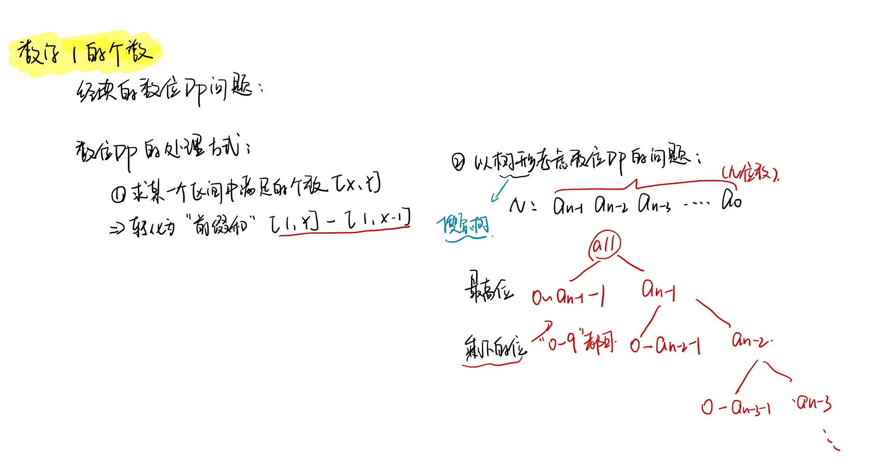
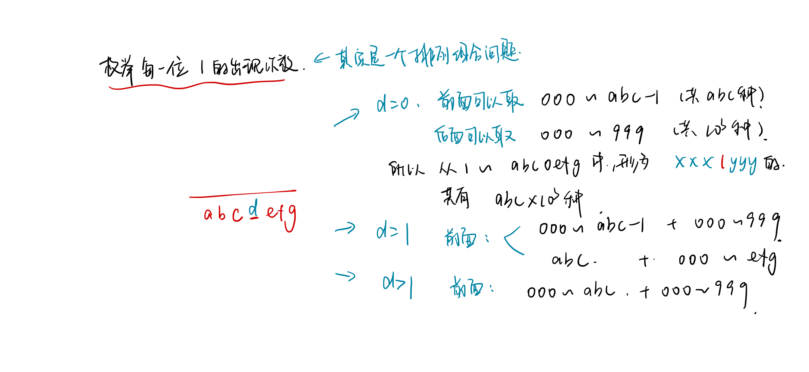

<!--
 * @Description: 
 * @Versions: 
 * @Author: Vernon Cui
 * @Github: https://github.com/vernon97
 * @Date: 2021-01-12 22:12:37
 * @LastEditors: Vernon Cui
 * @LastEditTime: 2021-01-13 20:09:40
 * @FilePath: /.leetcode/Users/vernon/Leetcode-notes/week24.md
-->

# Week 24 - Leetcode 231 - 240

#### 231 - 2的幂

是2的幂次 就证明 这个数的二进制位只能有一个1;

lowbit运算: 返回保留最后一个1的二进制数 e.g. lowbit(1010) -> 10

其实就是 `x & (-x) == x`

```cpp
class Solution {
public:
    bool isPowerOfTwo(int n) {
        // 这题 2的幂次 证明 二进制只能有一个1
        if(n <= 0) return false;
        return (n & (-n)) == n;
    }
};
```

#### 232 - 用栈实现队列

怎么在栈中找到最早插入的元素？ -> 辅助栈 每次插入新元素都插入`stk`头部

> 感谢jp人提供的思路

```cpp
class MyQueue {
public:
    stack<int> stk, helper;
public:
    /** Initialize your data structure here. */
    MyQueue() = default;
    
    /** Push element x to the back of queue. */
    void push(int x) {
        // 每次插入 都插入到头部
        while(stk.size())
        {
            helper.push(stk.top());
            stk.pop();
        }
        stk.push(x);
        while(helper.size())
        {
            stk.push(helper.top());
            helper.pop();
        }
    }
    /** Removes the element from in front of queue and returns that element. */
    int pop() {
        int res = stk.top();
        stk.pop();
        return res;
    }
    
    /** Get the front element. */
    int peek() {
        return stk.top();
    }
    
    /** Returns whether the queue is empty. */
    bool empty() {
        return stk.empty();
    }
};
```

#### 233 - 数字1的个数

```diff
+ 数位DP
```

经典的数位DP了 快来复习一下数位DP

 

这一题 我们枚举的是每一位中1的出现次数


```cpp
class Solution {
public:
    int countDigitOne(int n) {
        if(n <= 0) return 0;
        // * 1. 把n的每一位扣出来
        int num = n;
        vector<int> nums;
        while(num)
        {
            nums.push_back(num % 10);
            num /= 10;
        }
        reverse(nums.begin(), nums.end());
        int left = 0, p = pow(10, nums.size() - 1), right = n % p, res = 0;
        // * 2. 计算每一位的1出现情况
        // 这里的left就是上面的abc right 就是efg 
        for(int i = 0; i < nums.size(); i++)
        {
            int d = nums[i];
            if(d == 0)  res += left * p;
            else if (d == 1) res += left * p + right + 1;
            else res += (left + 1) * p;
            // 处理
            left = left * 10 + nums[i];
            p /= 10;
            if(p) right = n % p;
        }
        return res;
    }
};
```

#### 234 - 回文链表

>进阶： 你能否用 O(n) 时间复杂度和 O(1) 空间复杂度解决此题？

这题把链表的好多操作都用上了：
- 找中点：快慢指针
- 反转链表

整体思路就是找到中点 -> 反转后半链表，得到两个子链表 -> 对比元素 不一致就不满足回文要求

```cpp
class Solution {
public:
    bool isPalindrome(ListNode* head) {
        // * 太经典了 找中点 后半部分反转链表 然后再遍历
        if(!head || !head->next) return true;
        ListNode* slow = head, *fast = head;
        while(fast && fast->next)
        {
            slow = slow->next;
            fast = fast->next->next;
        }
        // * 此时 slow 是中点前面的那个节点
        ListNode* a = slow, *b = slow->next;
        a->next = nullptr;
        while(b)
        {
            ListNode* tmp = b->next;
            b->next = a;
            a = b, b = tmp;
        }
        // * 此时 两个链表 一个头结点是head 一个头结点是a
        while(a && head)
        {
            if(a->val != head->val) return false;
            a = a->next;
            head = head->next;
        }
        return true;
    }
};
```

#### 235 - 二叉搜索树的最近公共祖先

肯定是递归搜索了 和root比 一大一小就是当前的root为答案, 不然就往两边走
相等直接返回即可（根据定义）

那个bool判断异或 `if((rootval < pval) ^ (rootval < qval))` 是两个之中保证一个成立的意思 简化if的判断条件

```cpp
class Solution {
public:
    TreeNode* lowestCommonAncestor(TreeNode* root, TreeNode* p, TreeNode* q) {
        // 肯定是递归搜索了 和root比 一大一小就是当前的root为答案
        // 最近公共祖先节点可以为节点本身。
        int pval = p->val, qval = q->val;
        while(root)
        {
            int rootval = root->val;
            if(rootval == pval || rootval == qval) return root;
            if((rootval < pval) ^ (rootval < qval)) return root;
            if(pval < rootval) root = root->left;
            else root = root->right;
        }
        return nullptr;   
    }
};
```

#### 236 - 二叉树的最近公共祖先

二叉树就没有二叉搜索树那么好的性质了
