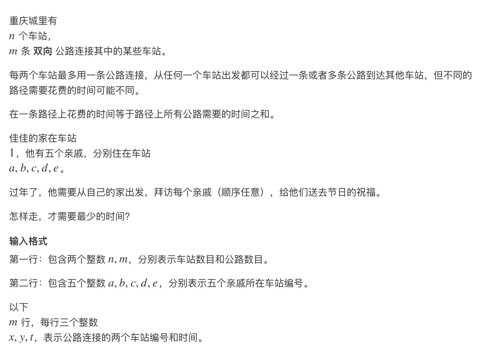
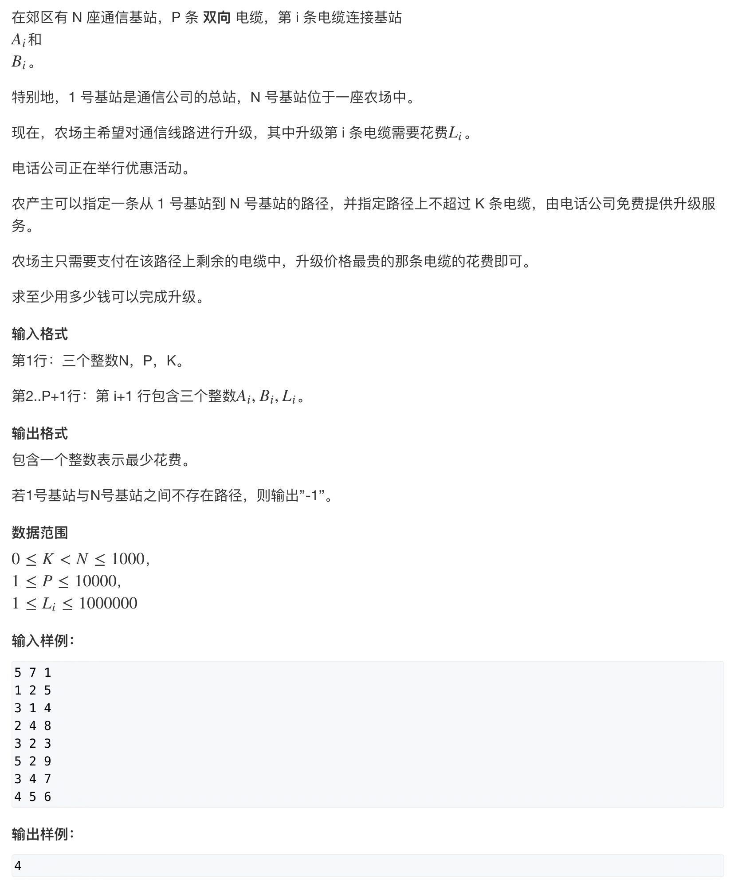

<!--
 * @Description: 
 * @Versions: 
 * @Author: Vernon Cui
 * @Github: https://github.com/vernon97
 * @Date: 2021-01-08 16:50:11
 * @LastEditors: Vernon Cui
 * @LastEditTime: 2021-01-11 19:22:32
 * @FilePath: /.leetcode/Users/vernon/Leetcode-notes/图论.md
-->
- [1. 建图](#1-建图)
- [2. 拓扑排序](#2-拓扑排序)
- [3. 最短路问题](#3-最短路问题)
  - [1. 堆优化版dijkstra: 适用于正（其实是非负）边权](#1-堆优化版dijkstra-适用于正其实是非负边权)
  - [2. Bellman-Ford](#2-bellman-ford)
  - [3. SPFA:(正负都可以）](#3-spfa正负都可以)
    - [1. SPFA  求最短路](#1-spfa--求最短路)
    - [2. SPFA 判断是否存在负环](#2-spfa-判断是否存在负环)
  - [4. floyd: 多源汇最短路](#4-floyd-多源汇最短路)
  - [5. 双端队列BFS: (只有0-1边权的最短路问题)](#5-双端队列bfs-只有0-1边权的最短路问题)
- [4.最小生成树问题](#4最小生成树问题)
  - [Kruskal 算法](#kruskal-算法)
- [5. 二分图](#5-二分图)
  - [1. 染色法判断二分图](#1-染色法判断二分图)
  - [2. 二分图的最大匹配-匈牙利算法](#2-二分图的最大匹配-匈牙利算法)
- [6. 最短路问题的综合应用](#6-最短路问题的综合应用)
  - [1. 最短路 + DFS](#1-最短路--dfs)
  - [2. 最短路 + 二分](#2-最短路--二分)


### 1. 建图

分为邻接表 和 邻接矩阵两种 邻接表用的比较多

```cpp
int n, m; // node 和 edge
int h[N], e[N], ne[N], idx;

void add(int a, int b)
{
    e[idx] = b, ne[idx] = h[a], h[a] = idx++;
}
```

### 2. 拓扑排序

拓扑排序就是统计每个点的入度，入度为0的一定在前面, 遍历每个入度为0的点，把他的邻接点的入度减1， 重复这个操作就得到拓扑排序的序列了；

此外，只有有向无环图才有拓扑排序 所以也是判断有没有环的一种方式；

```cpp
int n, m;
int h[N], ne[N], idx;
int q[N], d[N]; // 模拟栈 入度din

int add(int a, int b)
{
    e[idx] = b, ne[idx] = h[a], h[a] = idx++, d[b]++; // 额外统计b的入度
}
bool topsort()
{
    int hh = 0, tt = -1;
    for(int i = 1; i <= n; i++)
    {
        if(d[i] == 0) q[++tt] = i; // 入栈
    }
    while(hh <= tt)
    {
        int t = q[hh++];
        for(int i = h[t]; ~i; i = ne[i])
        {
            int j = e[i];
            d[j]--;
            if(d[j] == 0) q[++tt] = j;
        }
    }
    // 出栈顺序 也就是拓扑排序的顺序
    return tt == n - 1;
}
```

### 3. 最短路问题
   
最短路问题要写的可就多了 也是趁这机会好好复习一下吧

最短路问题主要记的有以下几个方法：

堆优化dijkstra, Bellman-Ford, SPFA, Floyd; 其实还有双端队列BFS(0 - 1 边权的最短路问题), 等会也写上吧

#### 1. 堆优化版dijkstra: 适用于正（其实是非负）边权

记住dijkstra是出栈（出队）时确定最小距离就好了

```cpp
typedef pair<int, int> PII; // 距离 + 编号

int n;
int h[N], w[N], e[N], ne[N], idx;
int dist[N]; // 存储每个点 和 1 的距离
bool st[N]; // 每个点的最短距离是否已经确定

int dijkstra()
{
    memset(dist, 0x3f, sizeof dist);
    dist[1] = 0；
    priority_queue<PII, vector<PII>, greater<PII>> heap;
    heap.emplace(0, 1); 

    while(heap.size())
    {
        PII t = heap.top();
        heap.pop();
        int ver = t.first, distance = t.second;
        // 记住了 dijkstra是在出队确定 
        if(st[ver]) continue;
        st[ver] = true;
        for(int i = h[ver]; ~i; i = ne[i])
        {
            int j = e[i];
            if(dist[j] > distance + w[i])
            {
                dist[j] = distance + w[i];
                heap.emplace(dist[j], j);
            }
        }
    }

    if(dist[n] = 0x3f3f3f3f) return -1;
    else return dist[n];
}
```

#### 2. Bellman-Ford

现在看来， Bellman-Ford 算法最适合解决的问题是**有边数限制的最短路问题**
剩下比如有负权边的最短路问题，负环的判断等等都可以用**SPFA**来解决

```cpp
int n, m;
int dist[N];

struct Edge
{
    int a, b, w;
}edges[M];

int bellman_ford()
{
    memset(dist, 0x3f, sizeof dist);
    dist[1] = 0;
    for(int i = 0; i < n; i++) // 在这里 这里的循环次数就是边数限制
        for(int j = 0; j < m; j++)
        {
            int a = edges[i].a, b = edges[i].b, w = edges[i].w;
            if(dist[b] > dist[a] + w)
                dist[b] = dist[a] + w;
        }
    // 注意这里的判断
    if(dist[n] > 0x3f3f3f3f / 2)
        return -1;
    return dist[n];
}
```

#### 3. SPFA:(正负都可以）

spfa 的代码其实和堆优化dijkstra很像 因为都是用堆去优化那个找当前最小距离的过程;

这两个的判断条件不一样 要记清:

- dijkstra 是出队就保证最短距离
- 但是spfa是出队都没有办法保证是最短距离，只要更新就要入栈，st数组的意义在于如果栈中有这个元素就不必再次加入了（因为肯定是要重算）

##### 1. SPFA  求最短路
   
```cpp
int n;
int h[N], e[N], w[N], ne[N], idx;
int dist[N];
bool st[N];

int spfa()
{
    memset(dist, 0x3f, sizeof dist);
    dist[1] = 0;
    queue<int> q;
    q.push(1);
    st[1] = true;

    while(q.size())
    {
        int t = q.front();
        q.pop();

        st[t] = false;
        for(int i = h[t]; ~i; i = ne[i])
        {
            int j = e[i];
            if(dist[j] > w[i] + dist[t])
            {
                dist[j] = w[i] + dist[t];
                if(!st[j])
                {
                    q.push(j);
                    st[j] = true;
                }
            }
        }
    }
}
```

##### 2. SPFA 判断是否存在负环

相较于求最短路 额外围护一个cnt数组，这个数组记录最短路径的节点数量 只要超过 n + 1 则证明必有负环存在

```cpp
int n;
int h[N], e[N], w[N], ne[N], idx;
int dist[N], cnt[N];
bool st[N];

bool spfa()
{
    memset(dist, 0x3f, sizeof dist);
    dist[1] = 0;
    queue<int> q;
    q.push(1);
    st[1] = true;

    while(q.size())
    {
        auto t = q.front();
        q.pop();

        st[t] = false;
        for(int i = h[t]; ~i; i = ne[i])
        {
            int j = e[i];
            if(dist[j] > dist[t] + w[i])
            {
                dist[j] = dist[t] + w[i];
                cnt[j] = cnt[t] + 1;
                if(cnt[j] >= n) return true;
                if(!st[j])
                {
                    q.push(j);
                    st[j] = true;
                }
            }
        }
    }
    return false;
}
```

#### 4. floyd: 多源汇最短路

基于动态规划 记住那三重循环的顺序 先遍历的是中间点k

```cpp
    for (int i = 1; i <= n; i ++ )
        for (int j = 1; j <= n; j ++ )
            if (i == j) d[i][j] = 0;
            else d[i][j] = INF;

// 算法结束后，d[a][b]表示a到b的最短距离
void floyd()
{
    for (int k = 1; k <= n; k ++ )
        for (int i = 1; i <= n; i ++ )
            for (int j = 1; j <= n; j ++ )
                d[i][j] = min(d[i][j], d[i][k] + d[k][j]);
}
```

同样的 可以将floyd退化为bool值 这样直接判断是否连通

#### 5. 双端队列BFS: (只有0-1边权的最短路问题)

对于只有0 - 1 两种边权的最短路问题，可以用双端队列广搜来实现 不必维护一个heap;

```cpp
int bfs()
{
    memset(st, false, sizeof st);
    memset(dist, 0x3f, sizeof dist);

    dist[1] = 0;
    deque<int> q;
    q.push_back(1);

    while(q.size())
    {
        int t = q.front();
        q.pop_front();
        if(st[t]) continue;
        st[t] = true;

        for(int i = h[t]; ~i; i = ne[i])
        {
            int j = e[i];
            if(dist[j] < dist[t] + w[i]) // 这里w[1] 只会取0 1
            {
                dist[j] = dist[t] + w[i];
                if(w[i]) q.push_back(j);
                else     q.push_front(j);
            }
        }
    }
    return dist[n];
}
``` 

### 4.最小生成树问题

最小生成树就记一个`Kruskal`算法就好；

#### Kruskal 算法

Kruskal算法基于的是并查集，整体思路很简单, 将所有边按权重从小到大排序，枚举所有边`(a, b, w)` 如果 `a b`尚未连通，就将这条边加入集合中 并统计权重就好了；

```cpp
struct Edge
{
    int a, b, w;
    bool operator<(const Edge& e) const
    {
        return this->w < e.w;
    }
}edges[2 * N];

int p[N];

int find(int a)
{
    if(p[a] != a) p[a] = find(p[a]);
    return p[a];
}

// 并查集初始化
for(int i = 1; i <= n; i++)
    p[i] = i;

// 读入edges
...
int res = 0, cnt = 0;
for(int i = 0; i < n; i++)
{
    int a = edges[i].a, b = edges[i].b, w = edges[i].w;
    if(find(a) != find(b))
    {
        p[find(a)] = find(b);
        res += w;
        cnt++;
    }
}

// 最小生成树 n个点连通一定是n - 1 条边 这也是连通性判断的一个依据
if(cnt < n - 1) puts("impossible");
else printf("%d\n", res);
```

**对于Kruskal算法而言 可以只求前一半 - 最小生成森林 / 后一半 - 缩点的最小生成树 都是可以的；**

有这样两个性质：
    - 最小生成树的边数一定是n - 1
    - 得到的解不仅是边权和最小，最大边权也最小

### 5. 二分图

二分图这一块有判断是否是二分图（染色法） 和 二分图的最大匹配（匈牙利算法）两块；

#### 1. 染色法判断二分图

染色法判断二分图的实质就是DFS；**一个边连接的两个点不会是同一个颜色**

0 - 未染色 1 - 颜色1 2 - 颜色2

```cpp
bool is_bi_graph()
{
    for(int i = 1; i <= n; i++)
        if(!color[i])
            if(!dfs(i, 1)) return false;
    return true;
}

bool dfs(int a, int c)
{
    color[a] = c;
    for(int i = h[a]; ~i; i = ne[i])
    {
        int j = e[i];
        if(!color[j])
        {
            if(!dfs(j, 3 - c)) return false;
        }
        else if (color[j] == c) return false;
    }
    return true;
}

```

#### 2. 二分图的最大匹配-匈牙利算法

这个要好好背一下；

```cpp
int n1, n2; // n1 表示第一个集合中的点数 n2 表示第二个
int h[N], e[M], ne[M], idx; // 匈牙利算法只用存集合1到集合2的边
int match[N]; // 存储第二个集合中的每个点当前匹配的第一个集合中的点
bool st[N]; // 存储第二个集合中的每个点是否被当前点遍历过

bool find(int x)
{
    for(int i = h[x]; ~i; i = ne[i])
    {
        int j = e[i];
        if(!st[j])
        {
            st[j] = true;
            if(match[j] == 0 || find(match[j])) // j还未匹配 或者 之前匹配的可以匹配其他人
            {
                match[j] = x;
                return true;
            }
        }
    }
    return false;
}

int res = 0;
for(int i = 1; i <= n1; i++)
{
    memset(st, false, sizeof st);
    if(find(i)) res++;
}
```

### 6. 最短路问题的综合应用

最短路问题可以和一些常见的算法结合考虑 

#### 1. 最短路 + DFS 



   - 先预处理从a, b, c, d, e除法 到其他所有点的单元最短路径
   - DFS搜索拜访顺序

#### 2. 最短路 + 二分



这个题简单来说 路径的权重等于 第k + 1 大边权 使其最小

> 最大值最小/最小值最大 一般都可以试试二分

对于本题 我们二分这个边权分界点 `x` 大于为1小于为0 再计算最短路；

如果最短路距离小于k 则证明 这条路上有多于k条边的值都小于x x需要增大
反过来x需要减小 就这样可以二分出边界，即为答案；

**等待更新（乖巧）**