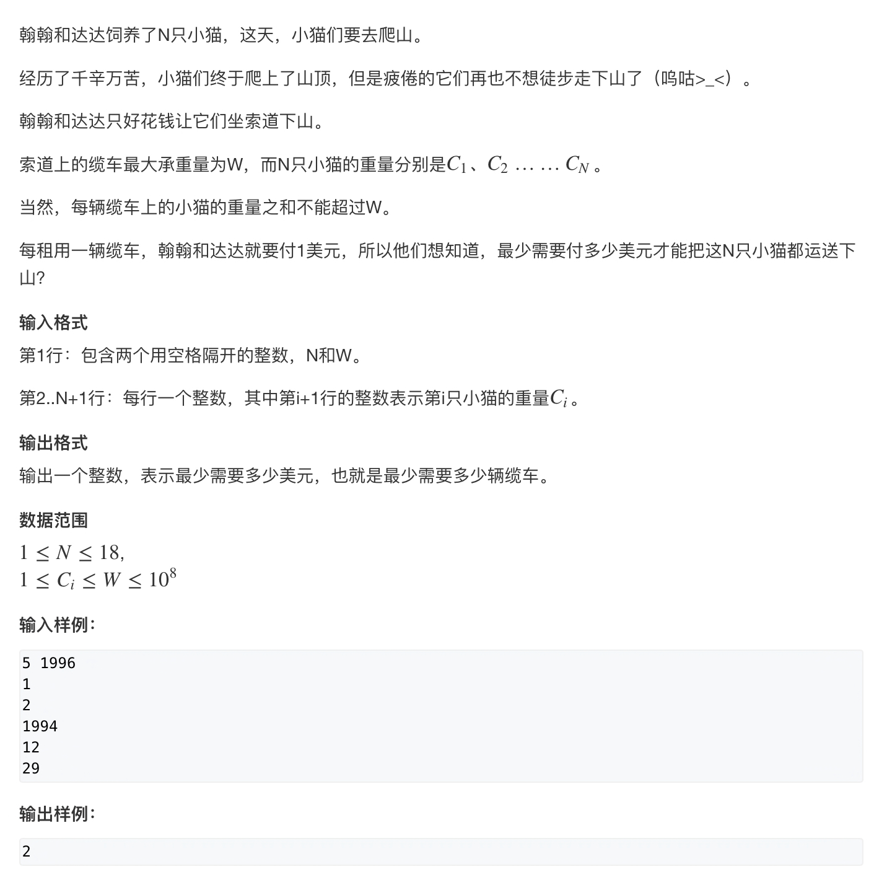

<!--
 * @Description: 
 * @Versions: 
 * @Author: Vernon Cui
 * @Github: https://github.com/vernon97
 * @Date: 2021-01-19 20:03:53
 * @LastEditors: Vernon Cui
 * @LastEditTime: 2021-01-19 21:06:24
 * @FilePath: /.leetcode/Users/vernon/Leetcode-notes/网易2021计算机视觉.md
-->
# 网易2021校招笔试-计算机视觉算法工程师（正式第二批）

编程题第一题和第二题 算法工程师的题一样 就不重复写了

### 03 - [编程题]小选货架

小选线下店最近准备新上架一批长度不等的商品, 用一个数组表示商品的长度，已知货架每一层的长度固定为X。
小选线下店是一个追求生活美学的店铺，为了摆放美观，每一层至多摆放两个商品，而且商品的总长度不能比货架长度长（已知单个商品的长度都不会比货架长）
请问至少需要多少层的货架，才能漂亮的摆放这些商品呢？

**输入描述:**

共两行
第一行为一个整数，表示货架的长度X
第二行为一组整数数组，由空格分割，数组中的值表示商品的长度

**输出描述:**

仅一行一个整数表示答案，即最少需要的货架层数

**输入例子1:**
```
3
1 2
```
**输出例子1:**
```
1
```
**例子说明1:**

>（1，2）摆放在同一层货架即可

**输入例子2:**
```
3
3 3 2 2 1
```
**输出例子2:**
```
4
```
**例子说明2:**

>（3）（3）（2，1）（2） 四层货架摆放
---
是经典的搜索题了 为什么经典呢 看看这个题


同样的题了 本题的枚举顺序就是：
> 对于每个商品 放在已有的货架 or 新开一个货架

这里DFS的剪枝：
- **优化搜索顺序** 优先搜索分支较少的节点：排序 从大到小搜索
- **可行性剪枝** 如果超过货架长度直接跳过
- **最优性剪枝** 如果当前的方案比已经搜到的最优解的货架数还多 直接返回

判题的答案有问题 

```cpp
#include <iostream>
#include <cstdio>
#include <algorithm>
#include <vector>
#include <sstream>

using namespace std;

int n, m, ans; // n 数字个数 m 货架长度
vector<int> w, sum;
void dfs(int u, int k)
{
    // 最优性剪枝
    if(k >= ans) return;
    if(u == n)
    {
        ans = k;
        return;
    }
    // 1. 加入已有的货架中
    for(int i = 0; i < k; i++)
    {
        if(sum[i] + w[u] <= m)
        {
            sum[i] += w[u];
            dfs(u + 1, k);
            sum[i] -= w[u];
        }
    }
    // 2. 创建新的货架
    sum[k] += w[u];
    dfs(u + 1, k + 1);
    sum[k] -= w[u];
}
int main()
{
    scanf("%d\n", &m);
    int x;
    while(cin >> x)
        w.push_back(x);
    n = w.size();
    sum = vector<int>(n + 1, 0);
    // 排序
    sort(w.begin(), w.end(), greater<int>());
    ans = n;
    dfs(0, 0);
    printf("%d\n", ans);
    return 0;
}
```

